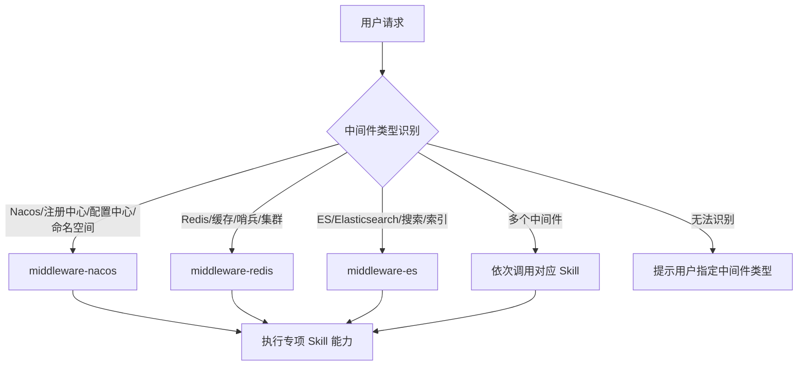

# 中间件智能运维 Skill 系统需求规格说明书

**版本**：V4.0  
**日期**：2026-05-26  
**状态**：正式

---

## 文档历史

| 版本 | 日期       | 修订说明                                                     | 作者   |
| ---- | ---------- | ------------------------------------------------------------ | ------ |
| V1.0 | 2026-05-06 | 初稿，整合对话中的需求和架构澄清，形成可行文档               | 项目组 |
| V2.0 | 2026-05-07 | 重构方案：移除独立 Agent 运行时，改为纯 Skill 驱动架构；补充工具 Schema、决策树、输出规范、分阶段交付计划 | 项目组 |
| V3.0 | 2026-05-08 | 对标业界方案增强：新增知识库/RAG、容量预测、跨中间件关联、置信度评分、自动修复建议、Skill 质量评估、MCP 集成预留等能力；新增 Skill 分发与维护策略章节 | 项目组 |
| V4.0 | 2026-05-26 | 结构化完善：新增项目概述、总体设计、详细设计、AI技术应用方案、测试方案、经验总结等章节，形成完整的需求规格与设计文档体系 | 项目组 |

---

## 目录

1. [引言](#1-引言)
2. [项目概述](#2-项目概述)
3. [总体描述](#3-总体描述)
4. [总体设计](#4-总体设计)
5. [详细设计](#5-详细设计)
6. [Skill 通用规范](#6-skill-通用规范)
7. [Nacos Skill 详细需求](#7-nacos-skill-详细需求)
8. [Redis Skill 详细需求](#8-redis-skill-详细需求)
9. [Elasticsearch Skill 详细需求](#9-elasticsearch-skill-详细需求)
10. [外部工具集成规范](#10-外部工具集成规范)
11. [安全与权限控制](#11-安全与权限控制)
12. [AI技术应用方案](#12-ai技术应用方案)
13. [增强能力：知识库与智能分析](#13-增强能力知识库与智能分析)
14. [测试方案](#14-测试方案)
15. [Skill 质量保障](#15-skill-质量保障)
16. [Skill 分发与维护策略](#16-skill-分发与维护策略)
17. [经验总结](#17-经验总结)
18. [分阶段交付计划](#18-分阶段交付计划)

---

## 1. 引言

### 1.1 编写目的

本需求文档旨在定义一套基于 IDE 智能体的 **中间件 Skill 系统**，为 Elasticsearch、Nacos、Redis 等中间件提供标准化的智能运维能力。系统以 **Skill 指令包** 为核心载体，将中间件开发规范、运维操作与故障诊断能力封装为 Markdown 格式的技能描述文件，IDE 智能体通过读取 Skill 指令，利用其内置能力（代码生成、文件操作、终端命令执行、代码搜索等）完成客户端代码生成、代码审查、集群资源管理和故障排查。

### 1.2 核心概念定义

- **Skill（技能）**：面向某一中间件的标准化的 Markdown 指令包（SKILL.md 文件），定义了该中间件场景下的触发条件、参数规范、处理流程、输出格式和安全约束。是中间件领域的"专业技能手册"。
- **IDE 智能体**：IDE 内置的大模型驱动助手（如 Qoder），拥有文件读写、代码搜索、终端命令执行等原生能力。Skill 通过指令引导智能体使用这些原生能力完成具体任务。
- **外部工具**：Skill 流程中需要调用的命令行工具或外部服务，包括 `paas-cli`（运维工具）和 `扁鹊`（故障诊断平台）。智能体通过终端命令执行（Terminal）方式调用这些工具。

### 1.3 适用范围

本文档覆盖以下三大中间件 Skill 的设计与实现：

- Nacos Skill
- Redis Skill
- Elasticsearch Skill

每个 Skill 均包含四项原子能力：**客户端创建及配置自动生成**、**代码优化检查**、**集群交互**、**故障排查**。

### 1.4 设计原则

1. **Skill 即指令**：Skill 是纯 Markdown 文件，不包含可执行代码。所有执行逻辑由 IDE 智能体根据 Skill 指令，利用其原生工具能力完成。
2. **最小外部依赖**：客户端生成和代码审计仅依赖智能体原生能力（代码生成、文件读写、代码搜索），不依赖任何外部工具。集群操作和故障排查需要 paas-cli 和扁鹊，作为可选增强能力。
3. **安全优先**：Skill 中必须明确定义高风险操作的确认流程和参数校验规则，防止误操作和命令注入。
4. **结构化输出**：每项能力的输出必须有明确的格式规范，确保结果可解析、可追踪。

---

## 2. 项目概述

### 2.1 项目背景

中间件（Nacos、Redis、Elasticsearch）是企业技术中台的核心基础设施，承载着服务注册与发现、配置管理、缓存加速、搜索检索等关键能力。传统的中间件使用和运维模式存在以下痛点：

1. **使用门槛高**：研发人员需要记忆复杂的 API 参数和配置规范，查阅厚重的操作手册，学习曲线陡峭。
2. **运维效率低**：运维人员需要手动执行大量 CLI 命令进行集群管理和故障排查，响应时间长、容易出错。
3. **规范落地难**：企业内部的中间件使用规范难以有效执行，代码审查依赖人工，覆盖率和一致性无法保证。
4. **故障排查慢**：故障发生时依赖经验丰富的运维人员手动排查，平均修复时间（MTTR）长，知识难以传承。

随着大语言模型（LLM）和 AI 智能体技术的快速发展，通过自然语言对话即可高效使用和运维中间件已成为可能。业界已有 Elastic AI Assistant、Dynatrace Davis AI、Datadog Bits AI、Middleware OpsAI 等方案，验证了 AI 赋能中间件运维的可行性和价值。

### 2.2 项目目标

| 目标层次 | 目标描述 | 衡量指标 |
|---------|---------|--------|
| **短期（MVP）** | 实现三大中间件的四项原子能力，验证 Skill 指令驱动模式可行性 | 代码生成可用率 ≥ 85%，审计准确率 ≥ 80% |
| **中期（增强）** | 引入知识库/RAG、置信度评分、容量预测等增强能力，提升输出质量和智能化水平 | 诊断准确率 ≥ 70%，用户满意度 ≥ 4.0/5.0 |
| **长期（智能运维）** | 实现跨中间件关联分析、修复动作编排、MCP 集成，接近业界 OpsAI 全流程自动化水平 | 自动修复覆盖率 ≥ 60%，MTTR 降低 50% |

### 2.3 项目范围

**包含范围**：
- 三大中间件（Nacos、Redis、Elasticsearch）的智能运维 Skill 设计与实现
- 四项原子能力：客户端创建与配置、代码优化检查、集群交互、故障排查
- Skill 的分发、安装、版本管理和定制覆盖机制
- 增强能力：知识库/RAG、置信度评分、容量预测、跨中间件关联、修复编排

**不包含范围**：
- 中间件本身的开发、编译与部署
- IDE 智能体的底层模型训练与微调
- 独立后端微服务的开发与运维
- 外部工具（paas-cli、扁鹊）的开发与维护

### 2.4 项目干系人

| 角色 | 职责 | 关注点 |
|------|------|--------|
| 开发人员 | 使用 Skill 生成客户端代码、执行代码审计 | 代码生成准确性、审计规则有效性 |
| 运维人员 | 使用 Skill 管理集群、排查故障 | 命令执行成功率、诊断准确率 |
| 项目组负责人 | 管理项目组下的中间件资源 | 安全合规、资源使用效率 |
| Skill 开发团队 | 设计、编写、维护 Skill 文件 | Skill 可维护性、扩展性 |
| 平台运维团队 | 维护 paas-cli 和扁鹊平台 | 工具稳定性、API 兼容性 |

### 2.5 参考文档

| 文档名称 | 说明 |
|---------|------|
| 公共技术服务接入操作程序-第1部分：技术中台缓存（Redis）服务接入手册 | Redis 服务接入标准规范 |
| 公共技术服务接入操作程序-第2部分：技术中台消息（RocketMQ）服务接入手册 | 消息服务接入标准规范（参考） |
| 公共技术服务接入操作程序-第4部分：技术中台搜索Elasticsearch服务接入手册 | ES 服务接入标准规范 |
| Nacos/ES/Redis 全量使用命令文档 | paas-cli 全量命令参考 |
| 中间件 Skill 开发流程指南 | Skill 开发与验证流程 |
| Elastic AI Assistant 官方文档 | 业界 AI 辅助运维参考 |
| Dynatrace Davis AI 文档 | 业界因果分析参考 |
| MCP (Model Context Protocol) 规范 | 工具集成协议参考 |

---

## 3. 总体描述

### 3.1 产品愿景

让研发和运维人员通过**自然语言对话**即可高效使用和运维中间件，无需记忆复杂命令或查阅厚手册，大幅降低中间件使用门槛和故障响应时间。

### 3.2 用户特征

- **开发人员**：需要快速生成客户端代码，检查代码中中间件使用是否合规。
- **运维人员**：需要管理中间件集群（创建、扩缩容、查询状态），并进行故障诊断与应急处理。
- **项目组**：对应不同的资源池和权限空间，以项目编号（如 j036x0）区分。

### 3.3 功能总览

| 功能类别           | 实现方式                                                     | 是否需要外部工具 | 触发示例                                                     |
| ------------------ | ------------------------------------------------------------ | ---------------- | ------------------------------------------------------------ |
| 客户端代码自动生成 | 智能体根据 Skill 中的模板规范和参数，直接生成代码并写入文件 | 否               | "使用 Nacos 作为注册中心，项目组 j036x0，…在 src/main 下创建客户端" |
| 中间件代码优化检查 | 智能体扫描项目代码，依据 Skill 中定义的规则清单逐项检查     | 否               | "检查 Redis 代码" 或 "中间件代码优化"                        |
| 集群资源管理       | 智能体通过终端执行 paas-cli 命令                             | 是（paas-cli）   | "查看 Nacos 集群的注册实例"                                  |
| 故障排查           | 智能体通过终端调用扁鹊诊断命令                               | 是（扁鹊）       | "故障排查" 或 "我的 Nacos 连不上了"                          |

---

## 4. 总体设计

### 4.1 设计目标与约束

| 设计目标 | 说明 | 约束条件 |
|---------|------|----------|
| 零外部依赖的核心能力 | 客户端生成和代码审计仅依赖智能体原生能力，无需安装任何外部工具 | 智能体需具备代码生成、文件读写、代码搜索等原生能力 |
| 纯 Markdown 指令驱动 | Skill 是结构化 Markdown 文件，不包含可执行代码，降低开发维护成本 | 智能体需能解析和执行 Markdown 格式的指令 |
| 安全优先的操作管控 | 高风险操作强制确认，命令参数白名单校验，敏感信息占位符处理 | 需要在便捷性和安全性之间取得平衡 |
| 可扩展的架构 | 新增中间件 Skill 有标准化流程，现有 Skill 可定制覆盖 | Skill 文件结构模板和规范需保持稳定 |
| 结构化可追踪的输出 | 每项能力输出有明确格式规范，支持问题定位和回溯 | 输出格式需兼顾可读性和可解析性 |

### 4.2 技术选型

| 技术领域 | 选型 | 选型理由 | 备选方案 |
|---------|------|---------|----------|
| IDE 智能体 | Qoder AI IDE | 内置代码生成、文件读写、终端执行、代码搜索等原生能力，支持 Skill 自动发现 | VS Code + Copilot、Cursor |
| Skill 格式 | Markdown (SKILL.md) | 智能体原生支持解析，无需额外运行时，版本管理友好 | YAML 配置 + 代码插件 |
| 外部工具调用 | 终端命令执行 | 智能体原生能力，无需额外集成开发，支持任意 CLI 工具 | MCP 协议（中期演进） |
| 知识库 | Markdown 文件 + RAG | 结构化文档作为附加上下文注入，智能体原生支持文件读取 | 向量数据库 + 语义检索 |
| 版本管理 | Git Tag + 语义化版本 | 与项目代码统一管理，天然具备版本追溯和回滚能力 | 独立版本注册中心 |

### 4.3 核心设计决策

#### 决策1：纯 Skill 驱动 vs Agent Runtime

| 方案 | 优点 | 缺点 |
|------|------|------|
| 纯 Skill 驱动（✅ 已选） | 零后端依赖，开发维护简单，随项目代码版本管理 | 受限于智能体原生能力，复杂逻辑难以编排 |
| Agent Runtime | 可实现复杂工作流，支持状态管理和定时任务 | 需独立后端服务，增加运维成本和故障点 |

**决策理由**：MVP 阶段以零外部依赖为优先，纯 Skill 驱动足以覆盖四项核心能力。Agent Runtime 作为长期演进方向。

#### 决策2：终端命令 vs MCP 协议

| 方案 | 优点 | 缺点 |
|------|------|------|
| 终端命令执行（✅ 短期） | 零集成成本，支持任意 CLI 工具 | 输出解析依赖正则/文本处理，参数传递安全性需额外保障 |
| MCP 协议（中期演进） | 结构化输入/输出，更安全的参数传递，工具发现能力 | 需外部工具提供 MCP Server，增加集成开发成本 |

**决策理由**：短期以最低成本实现集成，Skill 中将命令模板和参数约束独立成段，便于未来切换到 MCP。

#### 决策3：单 Skill vs 多 Skill 路由

| 方案 | 优点 | 缺点 |
|------|------|------|
| 单 Skill 全覆盖 | 简单，无路由逻辑 | 文件过长影响智能体理解，不同中间件规则混杂 |
| 入口路由 + 专项 Skill（✅ 已选） | 职责清晰，各 Skill 独立维护，扩展新中间件无需修改现有 Skill | 需维护路由逻辑，增加一个入口 Skill |

**决策理由**：多 Skill 架构更符合单一职责原则，且 SKILL.md 行数控制在 500 行以内以保证智能体理解质量。

### 4.4 系统架构

### 4.5 整体架构

```
┌──────────────────────────────────────────────────────────────┐
│                     用户对话入口 (IDE 聊天窗口)                │
└──────────────────────────┬───────────────────────────────────┘
                           │ 自然语言
                           ▼
┌──────────────────────────────────────────────────────────────┐
│                    IDE 智能体 (Agent)                         │
│                                                              │
│   ┌────────────────────────────────────────────────────┐     │
│   │             Skill 指令层 (SKILL.md)                │     │
│   │  ┌──────────┐ ┌──────────┐ ┌──────────┐           │     │
│   │  │ Nacos    │ │ Redis    │ │ ES       │           │     │
│   │  │ Skill    │ │ Skill    │ │ Skill    │           │     │
│   │  └──────────┘ └──────────┘ └──────────┘           │     │
│   └────────────────────────────────────────────────────┘     │
│                                                              │
│   ┌────────────────────────────────────────────────────┐     │
│   │           智能体原生能力层                          │     │
│   │  • 代码生成与编辑        • 文件读写                 │     │
│   │  • 代码搜索与分析        • 终端命令执行              │     │
│   └────────────────────────────────────────────────────┘     │
└──────────┬───────────────────────────────────┬───────────────┘
           │                                   │
           │ 终端命令                           │ 文件系统
           ▼                                   ▼
┌──────────────┐  ┌──────────────┐  ┌──────────────────────┐
│ 扁鹊平台      │  │ paas-cli      │  │ 项目代码仓库          │
│ (故障诊断)    │  │ (运维工具)    │  │ (客户端代码 & 配置)   │
└──────────────┘  └──────────────┘  └──────────────────────┘
```

### 4.6 架构关键说明

1. **无独立后端服务**：整个系统不依赖任何自研后端微服务。智能体是 IDE 内置能力，Skill 是纯 Markdown 指令文件。
2. **Skill 的角色**：Skill 不是可执行代码，而是结构化的"操作手册"，告诉智能体在什么场景下、收集什么参数、按什么流程、用什么格式输出。
3. **外部工具调用方式**：智能体通过其原生终端命令执行能力调用 paas-cli 和扁鹊。Skill 中定义命令模板和参数约束，智能体负责参数填充和执行。
4. **能力分层**：客户端生成和代码审计是纯智能体能力，零外部依赖；集群操作和故障排查依赖终端工具，属于增强能力。

### 4.7 Skill 文件组织结构

```
skills/
 ├── middleware/SKILL.md          # 通用中间件入口 Skill（路由层）
 ├── middleware-nacos/SKILL.md    # Nacos 专项 Skill
 ├── middleware-redis/SKILL.md    # Redis 专项 Skill
 └── middleware-es/SKILL.md       # Elasticsearch 专项 Skill
```

- **通用入口 Skill**（middleware）：负责识别中间件类型，将请求路由到对应的专项 Skill。
- **专项 Skill**：各中间件的完整能力定义，包含四项原子能力的详细流程。

---

## 5. 详细设计

### 5.1 Skill 路由设计

通用入口 Skill（middleware）负责识别用户意图中的中间件类型，将请求路由到对应专项 Skill。

**路由决策逻辑**：



**路由规则**：

| 关键词模式 | 路由目标 |
|-----------|----------|
| Nacos / 注册中心 / 配置中心 / 命名空间 | middleware-nacos |
| Redis / 缓存 / 缓存数据库 / 哨兵 | middleware-redis |
| ES / Elasticsearch / 搜索引擎 / 索引 | middleware-es |

**多中间件场景**：如用户同时提及多个中间件（如“Nacos 和 Redis 都连不上”），依次调用对应 Skill 并综合结果。

### 5.2 客户端生成组件设计

#### 5.2.1 模板引擎机制

客户端生成采用**模板 + 参数替换**模式：

1. 每种中间件 × 语言组合对应一组代码模板，存储在 `references/` 目录中
2. 智能体根据用户提供的参数（language、mode、client_type 等）选择对应模板
3. 通过 paas-cli 动态获取环境连接信息（地址、命名空间等）
4. 将参数和连接信息填入模板，生成最终代码
5. 将生成的代码写入用户指定的 target_path

#### 5.2.2 多语言支持策略

| 语言 | 模板存储位置 | 生成文件 | 依赖管理 |
|------|------------|---------|----------|
| Java | references/{middleware}-java-template.md | *Config.java, *Service.java, application.yml / bootstrap.yml | Maven 依赖提示 |
| Go | references/{middleware}-go-template.md | *_client.go, config.yaml | Go mod 依赖提示 |
| Python | references/{middleware}-python-template.md | *_client.py, config.yaml | Pip 依赖提示 |

#### 5.2.3 参数收集与校验流程

```
用户请求 → 检查必要参数 → 缺失?
    ├─ 是 → 优先从上下文推断（项目配置文件）
    │       → 仍缺失? → 主动询问用户（提供可选值提示）
    │       → 有默认值? → 使用默认值并在输出中注明
    └─ 否 → 继续
→ 通过 paas-cli 获取环境信息 → 选择模板 → 生成代码 → 写入文件 → 依赖提示
```

### 5.3 代码审计组件设计

#### 5.3.1 规则引擎设计

代码审计采用**规则清单 + 模式匹配**模式：

- 每个中间件 Skill 定义一组检查规则（规则ID + 描述 + 风险等级 + 检查方法）
- 规则详情存储在 `references/{middleware}-audit-rules.md` 中
- 智能体利用代码搜索能力（search_codebase、grep_code）按规则逐项检查
- 规则匹配结果按风险等级排序输出

#### 5.3.2 规则匹配算法

| 检查方法 | 使用的智能体工具 | 适用规则类型 |
|---------|----------------|-------------|
| 关键字搜索 | grep_code | 硬编码密码、配置缺失（REDIS-008、NACOS-004、ES-007） |
| 语义搜索 | search_codebase | 反模式检测（循环调用 getConfig、keys *） |
| 配置值分析 | read_file + grep_code | 参数合理性检查（连接池、超时、心跳） |
| 代码模式匹配 | search_codebase | 批量操作未用 Pipeline、深分页未用 search_after |

#### 5.3.3 审计输出格式化

审计结果按 [6.3.2 代码审计输出](#632-代码审计输出) 格式输出，包含：概要统计、问题列表（文件路径/行号/规则ID/风险等级/改进建议）、优先修复建议。

### 5.4 集群交互组件设计

#### 5.4.1 命令构造与参数化

智能体根据用户指定的操作类型，从 Skill 的操作矩阵中选择对应的 paas-cli 命令模板，将用户参数填入模板后执行。

**命令构造流程**：

1. 从操作矩阵中查找匹配的操作类型
2. 获取命令模板（如 `paas-cli nacos info --project {project_id} --env {env}`）
3. 对参数值进行白名单校验（见 [11. 安全与权限控制](#11-安全与权限控制)）
4. 校验通过 → 替换模板中的占位符，构造完整命令
5. 校验失败 → 拒绝执行，提示参数包含非法字符

#### 5.4.2 风险分级确认流程

```
用户请求操作 → 判断风险等级
    ├─ 🟢 低风险 → 直接执行 → 返回结果
    ├─ 🟡 中风险 → 展示完整命令 → 询问“是否继续?” → 用户确认后执行
    └─ 🔴 高风险 → 展示命令 + 影响范围说明 → 要求用户明确回复“确认” → 确认后执行
                                                        → 拒绝或超时 → 取消操作
```

#### 5.4.3 执行结果解析

智能体执行命令后，对终端输出进行解析，提取关键信息并按 [6.3.3 集群操作输出](#633-集群操作输出) 格式呈现。对于 JSON 格式输出，直接提取字段；对于文本格式输出，通过模式匹配提取关键信息。

### 5.5 故障排查组件设计

#### 5.5.1 诊断流程引擎

故障排查采用**阶梯式诊断**模式，从基础检查到深度分析逐层推进：

```
1. 信息收集（用户描述 + 环境信息）
      ↓
2. 基础状态检查（paas-cli）——确认集群是否在线
      ↓
3. 深度诊断（扁鹊）——执行专项诊断脚本
      ↓
4. 补充信息收集（可选）——针对性查询
      ↓
5. 综合分析与建议——生成诊断报告
```

#### 5.5.2 降级策略

```
用户请求故障排查 → 检查扁鹊可用性
    ├─ 可用 → 执行完整诊断流程（paas-cli + 扁鹊）
    └─ 不可用 → 降级到仅 paas-cli 基本状态检查
                → 在报告中注明“扁鹊不可达，诊断结果可能不完整”
                → 建议用户安装扁鹊 CLI 或联系平台运维
```

#### 5.5.3 推理链构建

故障排查输出中展示智能体的推理过程（Phase 4 增强能力），让用户理解诊断结论的推导路径：

```
推理链示例：
1. 用户报告 Nacos 连接超时 → 可能原因：网络/服务端/客户端
2. paas-cli 查询集群状态 → 集群健康 ✅ → 排除服务端故障
3. 扁鹊诊断网络连通性 → 客户端节点到 Nacos 端口不通 ❌
4. 结论：网络策略变更导致客户端与 Nacos 不通（置信度 92%）
```

### 5.6 外部工具接口设计

#### 5.6.1 paas-cli 接口规范

| 规范项 | 说明 |
|--------|------|
| 调用方式 | 智能体通过终端命令执行（run_in_terminal） |
| 命令格式 | `paas-cli <action> <resource> --gateway-config=config/gateway.yaml -f <config-file>` |
| 默认超时 | 30 秒，可通过 `--timeout` 参数调整 |
| 返回格式 | 文本或 JSON，智能体解析后结构化输出 |
| 错误处理 | 展示 stderr 内容，提供排查建议 |

#### 5.6.2 扁鹊接口规范

| 规范项 | 说明 |
|--------|------|
| 调用方式 | 智能体通过终端命令执行（run_in_terminal） |
| 命令格式 | `bianque diagnose --middleware {type} --project {project_id} --env {env} --check {items}` |
| 默认超时 | 60 秒（部分诊断脚本执行时间较长） |
| 返回格式 | JSON（包含 status、findings、logs、suggestions 字段） |
| 降级方案 | 不可达时回退到仅 paas-cli 基本状态查询 |

#### 5.6.3 前置条件检查

Skill 在执行需要外部工具的操作前，应先进行前置条件检查：

```
1. paas-cli 可用性检查：执行 `paas-cli --version`
   → 失败：提示安装方式及文档链接
2. 扁鹊可用性检查：执行 `bianque --version`
   → 失败：提示安装方式，本次操作降级为仅 paas-cli
3. 网络连通性检查：执行 `paas-cli ping`
   → 失败：提示检查网络连接
```

### 5.7 数据流设计

#### 5.7.1 客户端生成数据流

```
用户输入参数 → 智能体参数校验 → paas-cli 获取环境信息 → 模板选择
    → 参数填充 → 代码生成 → 文件写入 → 依赖提示输出
```

#### 5.7.2 代码审计数据流

```
用户指定扫描路径 → 智能体遍历项目文件 → 逐条规则匹配（grep_code/search_codebase）
    → 结果聚合 → 按风险等级排序 → 结构化审计报告输出
```

#### 5.7.3 集群操作数据流

```
用户指定操作类型 → 操作矩阵匹配 → 命令模板获取 → 参数白名单校验
    → 风险等级判断 → 确认流程（如需） → 终端命令执行 → 结果解析 → 结构化输出
```

#### 5.7.4 故障排查数据流

```
用户描述异常 → 信息收集 → paas-cli 状态检查 → 扁鹊诊断（可降级）
    → 补充信息收集（可选） → 综合分析 → 诊断报告输出（含推理链）
```

---

## 6. Skill 通用规范

所有专项 Skill 遵循统一的编写规范，确保一致性和可维护性。

### 6.1 Skill 文件结构模板

```markdown
---
name: "middleware-{type}"
description: "{中间件名称}中间件技能，提供客户端创建、代码优化检查、集群操作和故障排查能力。"
---

# {中间件名称}中间件

## 功能概述
（简要描述四项能力）

## 能力一：客户端创建与配置
### 触发条件
### 必要参数
### 处理流程（步骤编号）
### 输出格式
### 异常处理

## 能力二：代码优化检查
### 触发条件
### 必要参数
### 检查规则清单（表格：规则ID、规则描述、风险等级、检查方法）
### 输出格式
### 异常处理

## 能力三：集群交互
### 触发条件
### 必要参数
### 操作矩阵（表格：操作类型、paas-cli 命令模板、风险等级、是否需确认）
### 确认流程
### 输出格式
### 异常处理

## 能力四：故障排查
### 触发条件
### 必要参数
### 诊断流程（步骤编号，含扁鹊调用步骤）
### 输出格式
### 异常处理
```

### 6.2 参数收集规范

当用户请求中缺少必要参数时，智能体应按以下方式处理：

1. **优先从上下文推断**：如用户已打开项目，从项目配置文件中提取 `project_id`、`language` 等。
2. **主动询问缺失参数**：对必要参数逐一询问，提供可选值提示。
3. **使用合理默认值**：对有明确默认值的参数（如 `language` 默认 Java），可先使用默认值，在输出中注明。

### 6.3 输出格式规范

#### 6.3.1 客户端生成输出

```
✅ 客户端代码已生成

📁 生成文件列表：
  - {文件路径1} — {文件说明}
  - {文件路径2} — {文件说明}

📝 后续步骤：
  1. {步骤1}
  2. {步骤2}

⚠️ 注意事项：
  - {注意事项1}
```

#### 6.3.2 代码审计输出

```
📋 代码审计报告

📊 概要：共扫描 {N} 个文件，发现 {M} 个问题（🔴 严重 {x} | 🟡 警告 {y} | 🔵 建议 {z}）

| # | 文件路径 | 行号 | 规则ID | 问题描述 | 风险等级 | 改进建议 |
|---|---------|------|--------|---------|---------|---------|
| 1 | ... | ... | ... | ... | 🔴 严重 | ... |

💡 优先修复建议：{按风险等级排序的 Top 3 修复建议}
```

#### 6.3.3 集群操作输出

```
🔧 集群操作结果

操作：{操作类型}
目标：{中间件类型} / {环境} / {集群标识}
状态：✅ 成功 / ❌ 失败

📊 返回信息：
{paas-cli 命令输出内容}

⏱️ 执行耗时：{N}秒
```

#### 6.3.4 故障排查输出

```
🔍 故障诊断报告

🩺 诊断目标：{中间件类型} / {集群标识}
📡 诊断来源：扁鹊平台 / paas-cli

📊 诊断结论：{一句话结论}

📋 详细发现：
  1. {发现1}
  2. {发现2}

💡 处理建议：
  1. {建议1}（优先级：高）
  2. {建议2}（优先级：中）

📎 相关日志/数据：
{诊断脚本返回的关键数据摘要}
```

### 6.4 风险等级定义

| 等级 | 标识 | 含义 | 示例 |
|------|------|------|------|
| 严重 | 🔴 | 可能导致数据丢失、服务不可用或安全事故 | 密码硬编码、删除集群、循环调用 keys * |
| 警告 | 🟡 | 可能导致性能下降或潜在风险 | 连接池参数不合理、未使用 Pipeline |
| 建议 | 🔵 | 不影响功能但不符合最佳实践 | 未启用本地快照、缺少重试配置 |

### 6.5 操作风险分级与确认流程

| 风险等级 | 操作类型 | 确认要求 |
|---------|---------|---------|
| 🟢 低风险 | 查询、状态检查 | 无需确认，直接执行 |
| 🟡 中风险 | 扩缩容、配置变更 | 向用户展示即将执行的命令，等待用户确认后执行 |
| 🔴 高风险 | 删除、升级、主备切换 | 向用户展示命令及影响范围，必须获得明确确认（用户回复"确认"）后方可执行 |

---

## 7. Nacos Skill 详细需求

### 7.1 客户端创建与配置

**触发条件**：用户请求创建 Nacos 客户端并生成配置

**必要参数**：

| 参数 | 类型 | 必填 | 默认值 | 说明 |
|------|------|------|--------|------|
| project_id | string | 是 | — | 项目组编号，如 j036x0 |
| env | enum | 是 | — | 环境：DEV / SIT / SRV |
| auth_user | string | 是 | — | Nacos 用户名 |
| auth_pass | string | 是 | — | Nacos 密码 |
| target_path | string | 是 | — | 代码生成目标路径 |
| language | enum | 否 | Java | 项目语言：Java / Go / Python |

**处理流程**：

1. **参数收集**：确认所有必要参数，缺失项主动询问用户。
2. **环境信息查询**：通过终端执行 paas-cli 命令，根据 `project_id` 和 `env` 获取 Nacos 服务地址和命名空间。
   ```
   paas-cli nacos config --project {project_id} --env {env}
   ```
3. **代码生成**：根据 `language` 选择对应模板，生成以下文件：
   - **Java**：NacosConfigService.java（配置服务类）、NacosDiscoveryService.java（服务发现类）、bootstrap.yml（配置文件）
   - **Go**：nacos_client.go、config.yaml
   - **Python**：nacos_client.py、config.yaml
4. **文件写入**：将生成的代码写入 `target_path` 指定目录。
5. **依赖提示**：列出需要添加的 Maven/Go mod/Pip 依赖。

**输出**：按 [6.3.1 客户端生成输出](#631-客户端生成输出) 格式输出。

**异常处理**：
- paas-cli 命令执行失败 → 提示用户检查 paas-cli 是否安装及网络连通性，改为手动输入 Nacos 地址
- 目标路径不存在 → 询问用户是否创建目录
- 文件已存在 → 询问用户是否覆盖

### 7.2 代码优化检查

**触发条件**：用户请求检查 Nacos 代码优化

**必要参数**：

| 参数 | 类型 | 必填 | 默认值 | 说明 |
|------|------|------|--------|------|
| scan_path | string | 是 | — | 需扫描的项目根目录 |

**检查规则清单**：

| 规则ID | 规则描述 | 风险等级 | 检查方法 |
|--------|---------|---------|---------|
| NACOS-001 | 服务订阅是否启用本地快照（enableLocalSnapshot） | 🔵 建议 | 搜索 nacos 配置中是否设置 `enableLocalSnapshot=true` |
| NACOS-002 | 长轮询超时是否合理（configLongPollTimeout 建议 ≤ 30s） | 🟡 警告 | 搜索 `configLongPollTimeout` 配置值 |
| NACOS-003 | 是否循环调用 getConfig 而未使用 Listener | 🔴 严重 | 搜索循环体中的 `getConfig` 调用，检查是否有对应 Listener |
| NACOS-004 | 密码是否硬编码在源码中 | 🔴 严重 | 搜索源码中的 `password` 字段赋值，排除配置文件 |
| NACOS-005 | 心跳间隔、权重等是否符合最佳实践 | 🟡 警告 | 搜索 `heartBeatInterval`、`weight` 配置值 |
| NACOS-006 | 是否缺少异常处理和重试配置 | 🟡 警告 | 搜索 Nacos 客户端调用处是否有 try-catch 和重试逻辑 |
| NACOS-007 | 命名空间是否按环境隔离 | 🔵 建议 | 搜索 `namespace` 配置，检查不同环境是否使用不同 namespace |

**输出**：按 [6.3.2 代码审计输出](#632-代码审计输出) 格式输出。

**异常处理**：
- 扫描路径不存在 → 提示用户确认路径
- 未找到 Nacos 相关代码 → 告知用户未检测到 Nacos 客户端代码

### 7.3 集群交互

**触发条件**：用户请求与 Nacos 集群进行交互

**必要参数**：

| 参数 | 类型 | 必填 | 默认值 | 说明 |
|------|------|------|--------|------|
| project_id | string | 是 | — | 项目组编号 |
| env | enum | 是 | — | 环境：DEV / SIT / SRV |
| action | enum | 是 | — | 操作类型（见下表） |

**操作矩阵**：

| 操作类型 | paas-cli 命令模板 | 风险等级 | 需确认 |
|---------|-------------------|---------|--------|
| 查询集群信息 | `paas-cli nacos info --project {project_id} --env {env}` | 🟢 | 否 |
| 查询服务注册实例 | `paas-cli nacos instances --project {project_id} --env {env} --service {service_name}` | 🟢 | 否 |
| 查询配置列表 | `paas-cli nacos config-list --project {project_id} --env {env}` | 🟢 | 否 |
| 创建服务 | `paas-cli nacos create --project {project_id} --env {env} --service {service_name} --group {group}` | 🟡 | 是 |
| 扩缩容 | `paas-cli nacos scale --project {project_id} --env {env} --replicas {count}` | 🟡 | 是 |
| 配置灰度发布 | `paas-cli nacos gray-publish --project {project_id} --env {env} --config {config_id}` | 🟡 | 是 |
| 升级版本 | `paas-cli nacos upgrade --project {project_id} --env {env} --version {version}` | 🔴 | 是 |
| 删除服务 | `paas-cli nacos delete --project {project_id} --env {env} --service {service_name}` | 🔴 | 是 |

**确认流程**：
- 🟡 中风险操作：向用户展示完整命令，询问"是否继续执行？"，获得肯定回复后执行。
- 🔴 高风险操作：向用户展示完整命令及影响说明，要求用户明确回复"确认"后执行。

**输出**：按 [6.3.3 集群操作输出](#633-集群操作输出) 格式输出。

**异常处理**：
- paas-cli 未安装 → 提示安装方式
- 命令执行超时 → 提示用户检查网络，建议加 `--timeout` 参数重试
- 权限不足 → 提示用户联系管理员授权

### 7.4 故障排查

**触发条件**：用户请求 Nacos 故障排查或描述 Nacos 连接异常

**必要参数**：

| 参数 | 类型 | 必填 | 默认值 | 说明 |
|------|------|------|--------|------|
| project_id | string | 是 | — | 项目组编号 |
| env | enum | 是 | — | 环境 |
| symptom | string | 否 | — | 用户描述的异常现象 |

**诊断流程**：

1. **信息收集**：记录用户描述的异常现象。
2. **集群状态检查**：通过终端执行 paas-cli 查看 Nacos 集群基本状态。
   ```
   paas-cli nacos info --project {project_id} --env {env}
   ```
3. **扁鹊诊断**：通过终端调用扁鹊平台执行 Nacos 诊断脚本。
   ```
   bianque diagnose --middleware nacos --project {project_id} --env {env} --check health,raft,log
   ```
4. **补充信息收集**（可选）：如扁鹊诊断结果不充分，执行 paas-cli 进一步查询服务注册实例或配置状态。
5. **结果分析与建议**：综合诊断数据，生成处理建议。

**诊断能力**：

| 诊断项 | 检查内容 | 数据来源 |
|--------|---------|---------|
| 集群健康度 | 节点状态、Raft 一致性 | 扁鹊 |
| 日志分析 | 错误日志、异常堆栈 | 扁鹊 |
| 主备状态 | Leader 选举状态、同步延迟 | 扁鹊 + paas-cli |
| 客户端连通性 | 从客户端节点到 Nacos 的网络可达性 | 扁鹊 |

**输出**：按 [6.3.4 故障排查输出](#634-故障排查输出) 格式输出。

**异常处理**：
- 扁鹊不可达 → 回退到仅使用 paas-cli 进行基本状态检查
- 诊断脚本返回异常 → 展示原始错误信息，建议联系扁鹊平台运维

---

## 8. Redis Skill 详细需求

### 8.1 客户端创建与配置

**触发条件**：用户请求创建 Redis 客户端并生成配置

**必要参数**：

| 参数 | 类型 | 必填 | 默认值 | 说明 |
|------|------|------|--------|------|
| project_id | string | 是 | — | 项目组编号 |
| env | enum | 是 | — | 环境：DEV / SIT / SRV |
| password | string | 是 | — | Redis 密码 |
| target_path | string | 是 | — | 代码生成目标路径 |
| mode | enum | 否 | standalone | 部署模式：standalone / sentinel / cluster |
| client_type | enum | 否 | lettuce | 客户端库：jedis / lettuce |
| language | enum | 否 | Java | 项目语言：Java / Go / Python |

**处理流程**：

1. **参数收集**：确认所有必要参数，缺失项主动询问用户。特别注意 `mode` 参数，不同模式生成不同配置。
2. **环境信息查询**：通过终端执行 paas-cli 命令获取 Redis 连接信息。
   ```
   paas-cli redis config --project {project_id} --env {env}
   ```
3. **代码生成**：根据 `language`、`client_type`、`mode` 选择对应模板，生成以下文件：
   - **Java + Lettuce + Standalone**：RedisConfig.java（连接池配置）、RedisService.java（工具类）、application.yml
   - **Java + Jedis + Standalone**：JedisConfig.java、JedisService.java、application.yml
   - **Java + Lettuce + Sentinel**：RedisSentinelConfig.java、RedisService.java、application.yml
   - **Java + Lettuce + Cluster**：RedisClusterConfig.java、RedisService.java、application.yml
   - **Go**：redis_client.go、config.yaml
   - **Python**：redis_client.py、config.yaml
4. **文件写入**：将生成的代码写入 `target_path` 指定目录。
5. **依赖提示**：列出需要添加的依赖。

**输出**：按 [6.3.1 客户端生成输出](#631-客户端生成输出) 格式输出。

**异常处理**：同 Nacos 7.1 异常处理逻辑。

### 8.2 代码优化检查

**触发条件**：用户请求检查 Redis 代码优化

**必要参数**：

| 参数 | 类型 | 必填 | 默认值 | 说明 |
|------|------|------|--------|------|
| scan_path | string | 是 | — | 需扫描的项目根目录 |

**检查规则清单**：

| 规则ID | 规则描述 | 风险等级 | 检查方法 |
|--------|---------|---------|---------|
| REDIS-001 | 禁止在循环中使用 `keys *`，应使用 `scan` | 🔴 严重 | 搜索循环体内的 `keys(` 调用 |
| REDIS-002 | 大 Key 风险检查（单次操作 Value 超过 10KB 应拆分或压缩） | 🟡 警告 | 搜索大字符串直接 set 或大对象序列化写入 |
| REDIS-003 | 热 Key 风险检查（高频读写的 Key 应考虑本地缓存） | 🟡 警告 | 分析代码中高频调用的 Redis 操作模式 |
| REDIS-004 | 连接池参数合理性（maxTotal、maxIdle、maxWaitMillis） | 🟡 警告 | 搜索连接池配置参数，检查是否使用默认值或极端值 |
| REDIS-005 | Pipeline 批量使用情况（多次独立命令应使用 Pipeline） | 🔵 建议 | 搜索连续的 Redis 命令调用，检查是否使用 pipeline |
| REDIS-006 | Lua 脚本是否使用 EVALSHA 预加载（而非每次 EVAL） | 🔵 建议 | 搜索 `eval` 调用，检查是否有对应的 `scriptLoad` |
| REDIS-007 | 是否设置合理的过期时间（避免 Key 永不过期导致内存泄漏） | 🟡 警告 | 搜索 `set` 或 `setex` 调用，检查是否有过期时间 |
| REDIS-008 | 密码是否硬编码 | 🔴 严重 | 搜索源码中 `password` 字段赋值，排除配置文件 |

**输出**：按 [6.3.2 代码审计输出](#632-代码审计输出) 格式输出。

### 8.3 集群交互

**触发条件**：用户请求与 Redis 集群进行交互

**必要参数**：

| 参数 | 类型 | 必填 | 默认值 | 说明 |
|------|------|------|--------|------|
| project_id | string | 是 | — | 项目组编号 |
| env | enum | 是 | — | 环境 |
| action | enum | 是 | — | 操作类型 |

**操作矩阵**：

| 操作类型 | paas-cli 命令模板 | 风险等级 | 需确认 |
|---------|-------------------|---------|--------|
| 查看集群状态 | `paas-cli redis info --project {project_id} --env {env}` | 🟢 | 否 |
| 查看节点信息 | `paas-cli redis nodes --project {project_id} --env {env}` | 🟢 | 否 |
| 查看内存使用 | `paas-cli redis memory --project {project_id} --env {env}` | 🟢 | 否 |
| 创建实例 | `paas-cli redis create --project {project_id} --env {env} --mode {mode}` | 🟡 | 是 |
| 扩缩容 | `paas-cli redis scale --project {project_id} --env {env} --replicas {count}` | 🟡 | 是 |
| Slot 迁移 | `paas-cli redis slot-migrate --project {project_id} --env {env} --from {node} --to {node} --slots {range}` | 🔴 | 是 |
| 内存策略调整 | `paas-cli redis config --project {project_id} --env {env} --maxmemory-policy {policy}` | 🟡 | 是 |
| 升级版本 | `paas-cli redis upgrade --project {project_id} --env {env} --version {version}` | 🔴 | 是 |
| 删除集群 | `paas-cli redis delete --project {project_id} --env {env}` | 🔴 | 是 |

**确认流程**：同 Nacos 7.3 确认流程。

**输出**：按 [6.3.3 集群操作输出](#633-集群操作输出) 格式输出。

### 8.4 故障排查

**触发条件**：用户请求 Redis 故障排查或描述 Redis 连接/性能异常

**必要参数**：

| 参数 | 类型 | 必填 | 默认值 | 说明 |
|------|------|------|--------|------|
| project_id | string | 是 | — | 项目组编号 |
| env | enum | 是 | — | 环境 |
| symptom | string | 否 | — | 用户描述的异常现象 |

**诊断流程**：

1. **信息收集**：记录用户描述的异常现象。
2. **集群状态检查**：通过终端执行 paas-cli 查看 Redis 集群基本状态。
   ```
   paas-cli redis info --project {project_id} --env {env}
   ```
3. **扁鹊诊断**：通过终端调用扁鹊平台执行 Redis 诊断脚本。
   ```
   bianque diagnose --middleware redis --project {project_id} --env {env} --check slowlog,memory,replication
   ```
4. **补充信息收集**（可选）：如需进一步诊断，执行内存详情或慢查询命令。
5. **结果分析与建议**：综合诊断数据，生成处理建议。

**诊断能力**：

| 诊断项 | 检查内容 | 数据来源 |
|--------|---------|---------|
| 慢查询分析 | slowlog 中的高频慢命令 | 扁鹊 |
| 内存碎片率 | mem_fragmentation_ratio | 扁鹊 + paas-cli |
| 主从延迟 | replication offset 差异 | 扁鹊 |
| 持久化状态 | RDB/AOF 最后保存时间及状态 | 扁鹊 |
| 故障转移 | Sentinel 选举记录、Failover 日志 | 扁鹊 |

**输出**：按 [6.3.4 故障排查输出](#634-故障排查输出) 格式输出。

---

## 9. Elasticsearch Skill 详细需求

### 9.1 客户端创建与配置

**触发条件**：用户请求创建 ES 客户端并生成配置

**必要参数**：

| 参数 | 类型 | 必填 | 默认值 | 说明 |
|------|------|------|--------|------|
| project_id | string | 是 | — | 项目组编号 |
| env | enum | 是 | — | 环境：DEV / SIT / SRV |
| auth_user | string | 是 | — | ES 用户名 |
| auth_pass | string | 是 | — | ES 密码 |
| target_path | string | 是 | — | 代码生成目标路径 |
| client_version | enum | 否 | new | 客户端版本：new（ElasticsearchClient / 8.x+）/ old（RestHighLevelClient / 7.x） |
| language | enum | 否 | Java | 项目语言：Java / Go / Python |

**处理流程**：

1. **参数收集**：确认所有必要参数，特别确认 `client_version`（影响生成的 API 风格）。
2. **环境信息查询**：通过终端执行 paas-cli 命令获取 ES 连接信息。
   ```
   paas-cli es config --project {project_id} --env {env}
   ```
3. **代码生成**：根据参数组合生成文件：
   - **Java + new**：ElasticsearchConfig.java（客户端 Bean）、EsDocumentService.java（CRUD 工具类）、application.yml
   - **Java + old**：EsRestHighLevelConfig.java、EsDocumentService.java、application.yml
   - **Go**：es_client.go、config.yaml
   - **Python**：es_client.py、config.yaml
4. **文件写入**：将生成的代码写入 `target_path` 指定目录。
5. **依赖提示**：列出需要添加的依赖（特别注意新旧版本的 Maven artifact 不同）。

**输出**：按 [6.3.1 客户端生成输出](#631-客户端生成输出) 格式输出。

### 9.2 代码优化检查

**触发条件**：用户请求检查 ES 代码优化

**必要参数**：

| 参数 | 类型 | 必填 | 默认值 | 说明 |
|------|------|------|--------|------|
| scan_path | string | 是 | — | 需扫描的项目根目录 |

**检查规则清单**：

| 规则ID | 规则描述 | 风险等级 | 检查方法 |
|--------|---------|---------|---------|
| ES-001 | 深分页应使用 search_after 替代 from/size | 🔴 严重 | 搜索 `from` + `size` 组合使用，且 from 值 > 10000 |
| ES-002 | bulk 操作的批次大小应合理（建议 5-15MB） | 🟡 警告 | 搜索 bulk 操作，检查批次大小设置 |
| ES-003 | 索引映射设计是否合理（避免 dynamic mapping 导致类型混乱） | 🟡 警告 | 搜索索引创建代码，检查是否有显式 mapping 定义 |
| ES-004 | 高消耗脚本查询检测（script_query、painless 脚本） | 🔴 严重 | 搜索 `script` 相关查询，评估是否有性能风险 |
| ES-005 | 是否使用批量操作替代单条操作（批量索引/批量更新） | 🔵 建议 | 搜索循环中的单条 index/update 操作 |
| ES-006 | 连接超时和重试配置是否合理 | 🟡 警告 | 搜索 ES 客户端配置中的 timeout 和 retry 设置 |
| ES-007 | 密码是否硬编码 | 🔴 严重 | 搜索源码中 `password` 字段赋值，排除配置文件 |
| ES-008 | 是否合理使用索引别名（而非直接操作索引名） | 🔵 建议 | 搜索索引操作代码，检查是否使用别名 |

**输出**：按 [6.3.2 代码审计输出](#632-代码审计输出) 格式输出。

### 9.3 集群交互

**触发条件**：用户请求与 ES 集群进行交互

**必要参数**：

| 参数 | 类型 | 必填 | 默认值 | 说明 |
|------|------|------|--------|------|
| project_id | string | 是 | — | 项目组编号 |
| env | enum | 是 | — | 环境 |
| action | enum | 是 | — | 操作类型 |

**操作矩阵**：

| 操作类型 | paas-cli 命令模板 | 风险等级 | 需确认 |
|---------|-------------------|---------|--------|
| 查看集群状态 | `paas-cli es info --project {project_id} --env {env}` | 🟢 | 否 |
| 查看节点磁盘使用率 | `paas-cli es disk-usage --project {project_id} --env {env}` | 🟢 | 否 |
| 查看索引状态 | `paas-cli es indices --project {project_id} --env {env}` | 🟢 | 否 |
| 创建索引 | `paas-cli es create-index --project {project_id} --env {env} --name {index_name} --shards {n} --replicas {n}` | 🟡 | 是 |
| 索引滚动 | `paas-cli es rollover --project {project_id} --env {env} --alias {alias}` | 🟡 | 是 |
| Force merge | `paas-cli es force-merge --project {project_id} --env {env} --index {index_name} --max-segments {n}` | 🟡 | 是 |
| 扩缩容 | `paas-cli es scale --project {project_id} --env {env} --nodes {count}` | 🟡 | 是 |
| 升级版本 | `paas-cli es upgrade --project {project_id} --env {env} --version {version}` | 🔴 | 是 |
| 删除集群 | `paas-cli es delete --project {project_id} --env {env}` | 🔴 | 是 |

**确认流程**：同 Nacos 7.3 确认流程。

**输出**：按 [6.3.3 集群操作输出](#633-集群操作输出) 格式输出。

### 9.4 故障排查

**触发条件**：用户请求 ES 故障排查或描述 ES 集群/查询异常

**必要参数**：

| 参数 | 类型 | 必填 | 默认值 | 说明 |
|------|------|------|--------|------|
| project_id | string | 是 | — | 项目组编号 |
| env | enum | 是 | — | 环境 |
| symptom | string | 否 | — | 用户描述的异常现象 |

**诊断流程**：

1. **信息收集**：记录用户描述的异常现象。
2. **集群状态检查**：通过终端执行 paas-cli 查看 ES 集群基本状态。
   ```
   paas-cli es info --project {project_id} --env {env}
   ```
3. **扁鹊诊断**：通过终端调用扁鹊平台执行 ES 诊断脚本。
   ```
   bianque diagnose --middleware es --project {project_id} --env {env} --check cluster-health,shard,cpu,watermark
   ```
4. **补充信息收集**（可选）：如集群状态为 yellow/red，进一步查询未分配分片详情。
5. **结果分析与建议**：综合诊断数据，生成处理建议。

**诊断能力**：

| 诊断项 | 检查内容 | 数据来源 |
|--------|---------|---------|
| 集群健康状态 | Red / Yellow / Green 及原因 | 扁鹊 + paas-cli |
| 未分配分片 | UNASSIGNED 分片及分配失败原因 | 扁鹊 |
| CPU 热点 | 节点 CPU 使用率及热线程 | 扁鹊 |
| 写入拒绝 | 磁盘水位线、线程池队列拒绝 | 扁鹊 |
| 索引健康 | 副本分片状态、段合并情况 | 扁鹊 |

**输出**：按 [6.3.4 故障排查输出](#634-故障排查输出) 格式输出。

---

## 10. 外部工具集成规范

### 10.1 paas-cli

- **部署形态**：可执行二进制，预装在用户开发机或运维跳板机上。
- **调用方式**：智能体通过终端命令执行方式调用，Skill 中定义命令模板和参数约束。
- **命令执行安全**：
  - 禁止使用 `shell=True` 或字符串拼接构造命令
  - 命令参数必须经过白名单校验（见 [11. 安全与权限控制](#11-安全与权限控制)）
  - 高风险操作必须经过用户确认流程
- **超时处理**：所有 paas-cli 命令默认超时 30 秒，可通过 `--timeout` 参数调整。
- **错误处理**：命令执行失败时，向用户展示 stderr 内容，并提供排查建议。

### 10.2 扁鹊平台

- **部署形态**：内部运维平台，通过 CLI 工具或 HTTP API 访问。
- **调用方式**：智能体通过终端执行 `bianque` 命令，传入中间件类型、项目组、环境和检查项。
- **命令格式**：
  ```
  bianque diagnose --middleware {nacos|redis|es} --project {project_id} --env {env} --check {check_items}
  ```
- **返回格式**：JSON 格式，包含 `status`、`findings`、`logs`、`suggestions` 字段。
- **超时处理**：诊断命令默认超时 60 秒（部分诊断脚本执行时间较长）。
- **降级方案**：扁鹊不可达时，回退到仅使用 paas-cli 进行基本状态查询。

### 10.3 前置条件检查

Skill 在执行需要外部工具的操作前，应先进行前置条件检查：

```markdown
### 前置条件检查流程
1. 按 **paas-cli Skill** 解析 `$PAAS_CLI`，执行 `$PAAS_CLI version`（步骤 1：`paas-cli version`；降级：`python3 skills/paas-cli/paas-cli.py version`）
   - 失败 → 提示遵循 paas-cli Skill，勿继续
2. 按 **bianque Skill** 解析 `$BIANQUE`，执行 `$BIANQUE version`（步骤 1：`bianque version`；降级：`python3 skills/bianque/bianque.py version`）
   - 失败 → 本次操作降级为仅 paas-cli
3. 检查网络连通性：执行 `$PAAS_CLI ping`
   - 失败 → 提示用户检查网络连接
```

---

## 11. 安全与权限控制

### 11.1 命令注入防护

智能体构造终端命令时，必须遵守以下规则：

1. **参数化构造**：命令参数通过变量替换而非字符串拼接传入，避免 shell 元字符注入。
2. **输入校验白名单**：

| 参数 | 合法值规则 | 示例 |
|------|-----------|------|
| project_id | 仅允许小写字母、数字，格式如 j036x0 | `j036x0` ✅ `; rm -rf` ❌ |
| env | 枚举值：DEV / SIT / SRV | `DEV` ✅ `DEV; ls` ❌ |
| service_name | 仅允许字母、数字、下划线、短横线 | `order-service` ✅ `$(whoami)` ❌ |
| version | 语义化版本号格式 | `7.10.2` ✅ `7.10.2 && cat /etc/passwd` ❌ |
| count / replicas | 正整数 | `3` ✅ `3 || echo hack` ❌ |
| index_name | ES 索引命名规范（小写字母、数字、短横线） | `log-2026` ✅ `log"; rm -rf /` ❌ |

3. **危险字符过滤**：所有参数值中不得包含 `;`、`|`、`&`、`$`、`` ` ``、`(`、`)`、`{`、`}` 等 shell 元字符。如检测到，拒绝执行并提示用户。

### 11.2 高风险操作确认

- 🟡 中风险操作：展示命令后询问"是否继续？"
- 🔴 高风险操作：展示命令及影响范围，要求用户明确输入"确认"后执行
- 用户拒绝或超时未确认 → 取消操作，不执行任何命令

### 11.3 敏感信息处理

- **密码**：Skill 中不得以明文形式将密码写入代码文件。生成的配置文件中使用占位符（如 `${NACOS_PASSWORD}`），引导用户通过环境变量或密钥管理系统注入。
- **连接地址**：优先从 paas-cli 动态获取，避免在 Skill 指令中硬编码任何环境地址。

### 11.4 操作审计

- 每次执行的 paas-cli / bianque 命令及结果，应在智能体对话中完整展示，形成天然的操作审计记录。
- Skill 中应指示智能体在输出中包含：执行时间、完整命令、执行结果摘要。

---

## 12. AI技术应用方案

### 12.1 LLM 应用架构

本系统的 AI 能力基于 IDE 内嵌的大语言模型（LLM），通过 Skill 指令引导智能体执行具体任务。整体应用架构如下：

| 层次 | 组件 | 职责 |
|------|------|------|
| 交互层 | IDE 对话窗口 | 接收用户自然语言输入，展示智能体输出 |
| 指令层 | SKILL.md | 结构化 Prompt，定义触发条件、处理流程、输出格式 |
| 执行层 | IDE 智能体 | 解析 Skill 指令，调用原生工具执行任务 |
| 工具层 | 原生能力 + 外部工具 | 代码生成/搜索、文件读写、终端命令执行 |

**上下文窗口管理策略**：

1. **Skill 精简化**：SKILL.md 控制在 500 行以内，详细内容拆分到 `references/` 目录按需加载
2. **按需注入**：智能体仅在需要时读取 references 文件，避免一次性加载过多上下文
3. **优先级排序**：核心流程（触发条件→处理步骤→输出格式）优先加载，细节规则和模板按需加载
4. **历史对话压缩**：多轮对话中，智能体自动压缩早期对话内容，保留关键信息

### 12.2 Prompt Engineering 策略

Skill 指令本质上是一种结构化 Prompt，通过精心设计的指令格式引导智能体产生高质量输出。

#### 12.2.1 Skill 指令即 Prompt

Skill 文件本身即为结构化 Prompt，其设计遵循以下原则：

| Prompt 设计原则 | Skill 中的体现 |
|---------------|---------------|
| 角色设定 | Skill 的 name 和 description 字段定义智能体的角色和能力边界 |
| 任务分解 | 每项能力拆解为编号步骤，降低单步复杂度 |
| 输出约束 | 明确定义输出格式模板，确保结构化输出 |
| 异常处理 | 定义异常场景和处理策略，提升鲁棒性 |
| 安全边界 | 定义风险等级和确认流程，防止误操作 |

#### 12.2.2 Few-shot 示例设计

Skill 中的输出格式模板和示例即为 Few-shot 示例：

1. **客户端生成**：提供完整的输出格式示例（文件列表 + 后续步骤 + 注意事项），智能体仿照格式输出
2. **代码审计**：提供审计报告的表格格式示例，包含每列的定义和示例值
3. **集群操作**：提供操作结果的格式示例，确保关键信息（操作类型/状态/耗时）不遗漏
4. **故障排查**：提供诊断报告的格式示例，包含结论/发现/建议的层次结构

#### 12.2.3 输出格式约束

通过 Skill 中定义的输出格式模板，对智能体的输出施加结构性约束：

- **必须包含**的字段：使用 ✅ 📋 🔧 🔍 等标记明确标示
- **条件显示**的字段：根据执行结果显示不同内容（成功 ✅ / 失败 ❌）
- **禁止出现**的内容：明确禁止输出完整的密码明文、禁止跳过确认流程直接执行高风险操作

### 12.3 RAG 技术方案

#### 12.3.1 知识库构建策略

知识库分为三个层次，逐步构建：

| 知识库层次 | 内容 | 构建方式 | 优先级 |
|-----------|------|---------|--------|
| 规范知识库 | 企业中间件标准规范文档 | 从现有标准手册结构化提取为 Markdown | Phase 4 |
| 历史事故知识库 | 故障现象、根因、处理方式 | 每次故障排查后由智能体自动生成记录模板，人工补充确认 | Phase 4 |
| 运维 SOP 知识库 | 运维操作标准流程 | 从现有运维手册结构化提取 | Phase 5 |

#### 12.3.2 检索增强流程

```
用户请求 → Skill 指令解析 → 确定需要知识库支持
    → 读取相关知识库文件（.trae/knowledge/）
    → 将知识库内容作为附加上下文注入
    → 智能体结合 Skill 指令 + 知识库上下文生成输出
    → 输出中增加“参考依据”字段，引用知识库具体条目
```

#### 12.3.3 知识库文件组织

```
.trae/knowledge/
 ├── middleware-standards/          # 中间件规范文档
 │   ├── nacos-standard.md         # Nacos 标准规范（含编号条目）
 │   ├── redis-standard.md         # Redis 标准规范
 │   └── es-standard.md            # ES 标准规范
 ├── incident-records/             # 历史事故记录
 │   ├── 2026-05-06-nacos-raft-split.md
 │   └── 2026-04-20-redis-oom.md
 └── runbooks/                     # 运维 SOP
     ├── nacos-cluster-recovery.md
     ├── redis-failover.md
     └── es-red-cluster-fix.md
```

#### 12.3.4 引用与溯源机制

代码审计和故障排查的输出中增加“参考依据”字段，引用知识库中的具体规范条目或历史事故编号：

```
| # | 规则ID | 问题描述 | 风险等级 | 改进建议 | 参考依据 |
|---|--------|---------|---------|---------|--------|
| 1 | REDIS-001 | 循环中调用 keys * | 🔴 严重 | 使用 scan 替代 | 《Redis标准规范》第3.2节 |
| 2 | NACOS-004 | 密码硬编码 | 🔴 严重 | 迁移至环境变量 | 《Nacos安全规范》第2.1节 + 事故#2026-03-15 |
```

### 12.4 智能体能力编排

#### 12.4.1 工具调用链设计

不同能力类型使用不同的工具调用链：

| 能力 | 工具调用链 | 示例 |
|------|-----------|------|
| 客户端生成 | search_codebase → read_file → create_file/search_replace | 搜索现有配置 → 读取模板 → 生成并写入代码 |
| 代码审计 | grep_code × N → read_file → 输出格式化 | 按规则逐项搜索 → 读取具体文件确认 → 生成报告 |
| 集群操作 | run_in_terminal → 结果解析 → 输出格式化 | 执行 paas-cli 命令 → 解析输出 → 格式化呈现 |
| 故障排查 | run_in_terminal × 2+ → 结果分析 → 输出格式化 | paas-cli 状态检查 → 扁鹊诊断 → 综合分析 |

#### 12.4.2 多步骤任务编排

Skill 中的处理流程即为多步骤任务编排。每个步骤定义明确的输入、处理逻辑和输出，智能体按步骤顺序执行：

```
步骤1（输入：用户参数）→ 步骤2（输入：步骤1输出 + 环境信息）→ ... → 最终输出
```

**关键编排原则**：

1. **步骤间无隐式依赖**：每个步骤的输入来源明确声明，不依赖智能体的隐式推断
2. **异常步骤可跳过**：如扁鹊不可达，标记跳过并降级，不影响后续步骤执行
3. **结果可回溯**：每个步骤的输出在对话中完整展示，支持用户回溯检查

#### 12.4.3 上下文传递机制

多轮对话中的上下文传递策略：

| 场景 | 传递策略 | 示例 |
|------|---------|------|
| 单次任务 | Skill 全文作为 System Prompt 注入 | 用户说“检查 Redis 代码” |
| 多轮细化 | 保留前轮关键参数，追加新指令 | “检查 Redis 代码” → “重点看连接池配置” |
| 跨 Skill 协作 | 入口 Skill 传递中间件类型和参数到专项 Skill | “Nacos 和 Redis 都有问题” |

#### 12.4.4 错误恢复策略

| 错误类型 | 恢复策略 | 示例 |
|---------|---------|------|
| 工具调用失败 | 提示错误信息，提供替代方案或手动操作指引 | paas-cli 超时 → 建议加 --timeout 重试 |
| 参数校验失败 | 拒绝执行，提示修正 | 参数含危险字符 → 提示修改 |
| 外部工具不可用 | 降级到可用工具，标注信息不完整 | 扁鹊不可达 → 仅用 paas-cli 基本检查 |
| 智能体理解偏差 | 主动确认用户意图 | 用户表述模糊 → 列出可能的操作选项供选择 |

### 12.5 置信度评估与幻觉控制

#### 12.5.1 置信度评分机制

为代码审计的每条发现和建议增加置信度评估：

| 置信度 | 含义 | 建议操作 | 示例 |
|--------|------|----------|------|
| 🟢 高（≥90%） | 模式明确，规则匹配清晰 | 可直接修复 | 源码中明文包含 password=xxx |
| 🟡 中（60-90%） | 可能存在特殊情况需确认 | 建议人工确认后修复 | 连接池参数使用默认值，可能是有意为之 |
| 🔴 低（<60%） | 依赖上下文判断，可能误报 | 需人工详细分析 | 未使用 Pipeline，但业务可能不需要 |

#### 12.5.2 幻觉检测与缓解

针对 LLM 可能产生的幻觉问题，采用以下缓解策略：

| 幻觉类型 | 缓解策略 | 实现方式 |
|---------|---------|----------|
| 编造不存在的规则 | 审计输出必须引用 Skill 中定义的规则ID | 规则ID 白名单校验 |
| 虚构文件或代码 | 代码搜索结果必须来自实际项目文件 | 搜索工具返回真实文件路径 |
| 伪造命令输出 | 外部命令执行结果必须来自实际终端输出 | 命令输出在对话中完整展示 |
| 过度推理 | 故障排查结论必须有数据支撑 | 推理链每步关联具体数据 |

#### 12.5.3 人机协同决策点

在以下关键节点设置人机协同决策点，避免智能体独立做出高风险决策：

| 决策点 | 人工参与方式 | 触发条件 |
|--------|------------|----------|
| 高风险操作确认 | 用户明确回复“确认” | 🔴 高风险操作（删除、升级等） |
| 修复代码应用 | 用户确认代码变更 | 自动修复建议（Phase 5） |
| 诊断结论采纳 | 用户确认或修正结论 | 置信度 < 80% 的诊断结论 |
| 知识库引用 | 用户确认引用相关性 | 审计报告中的参考依据 |

#### 12.5.4 输出验证机制

| 输出类型 | 验证方式 | 验证内容 |
|---------|---------|----------|
| 生成代码 | 编译/语法检查 | 代码是否有语法错误、依赖是否完整 |
| 审计报告 | 规则ID 校验 | 报告中的规则ID是否在 Skill 定义范围内 |
| 集群操作 | 命令输出确认 | 终端输出是否与报告描述一致 |
| 诊断报告 | 数据溯源 | 推理链每步是否有对应的数据支撑 |

### 12.6 AI 技术演进路线

| 阶段 | 核心技术 | 能力特征 | 对应交付阶段 |
|------|---------|----------|-------------|
| **短期** | 纯 Prompt + Skill | 结构化指令驱动，零外部依赖 | Phase 1-3 |
| **中期** | Prompt + RAG + 置信度 | 知识库增强，输出可溯源可量化 | Phase 4 |
| **长期** | Agent Workflow + MCP | 多工具协同编排，结构化工具调用 | Phase 5-6 |
| **远期** | Multi-Agent + 自学习 | 多智能体协作，基于反馈自动优化规则 | 持续迭代 |

---

## 13. 增强能力：知识库与智能分析

对标 Elastic AI Assistant、Dynatrace Davis AI、Datadog Bits AI、Middleware OpsAI 等业界方案，在 Skill 基础能力之上规划以下增强能力。这些能力按实现难度从低到高排列，作为后续迭代的演进方向。

### 13.1 知识库与 RAG 增强

**业界参考**：Elastic AI Assistant 通过 RAG 从实际观测数据和知识库（runbook、历史事故记录）中检索上下文，确保回复不产生幻觉且贴合实际环境。

**当前不足**：现有 Skill 的代码审计和故障排查完全依赖 LLM 内置知识，无法感知企业内部的中间件规范文档、历史事故记录和运维 SOP。

**增强方案**：

1. **规范知识库**：将企业内部中间件标准规范手册（Nacos/Redis/ES 规范）结构化为 Markdown 文件，作为 Skill 的附加上下文注入。智能体在执行代码审计时，除了按 Skill 中定义的规则清单检查外，还可参照知识库中的完整规范进行扩展检查。

2. **历史事故知识库**：记录每次故障排查的结论（现象、根因、处理方式），形成结构化的历史事故记录。后续故障排查时，智能体可检索相似历史事故，提供更精准的建议。

   ```
   知识库文件组织：
   knowledge/
    ├── middleware-standards/          # 中间件规范文档
    │   ├── nacos-standard.md
    │   ├── redis-standard.md
    │   └── es-standard.md
    ├── incident-records/             # 历史事故记录
    │   ├── 2026-05-06-nacos-raft-split.md
    │   └── 2026-04-20-redis-oom.md
    └── runbooks/                     # 运维 SOP
        ├── nacos-cluster-recovery.md
        ├── redis-failover.md
        └── es-red-cluster-fix.md
   ```

3. **知识库引用**：在代码审计和故障排查的输出中，增加"参考依据"字段，引用知识库中的具体规范条目或历史事故编号，提高结论的可信度和可追溯性。

   ```
   # 代码审计输出增强示例
   | # | 规则ID | 问题描述 | 风险等级 | 改进建议 | 参考依据 |
   |---|--------|---------|---------|---------|--------|
   | 1 | REDIS-001 | 循环中调用 keys * | 🔴 严重 | 使用 scan 替代 | 《Redis标准规范》第3.2节 |
   ```

### 13.2 置信度评分与自动修复建议

**业界参考**：Middleware OpsAI 对自动修复设定 95% 置信度阈值，仅在确信时才执行修复；Dynatrace Davis AI 提供因果分析链路，解释推理过程。

**当前不足**：现有 Skill 输出的检查结果和建议没有置信度分级，用户无法判断哪些建议可以直接采纳、哪些需要人工验证。

**增强方案**：

1. **置信度评分**：为代码审计的每条发现和建议增加置信度评估：

   | 置信度 | 含义 | 建议操作 |
   |--------|------|----------|
   | 🟢 高（≥90%） | 模式明确，规则匹配清晰 | 可直接修复 |
   | 🟡 中（60-90%） | 可能存在特殊情况需要确认 | 建议人工确认后修复 |
   | 🔴 低（<60%） | 依赖上下文判断，可能为误报 | 需人工详细分析 |

2. **自动修复建议**：对于高置信度问题，Skill 可指导智能体直接生成修复代码：

   ```
   # 代码审计输出增强示例
   | # | 规则ID | 问题描述 | 置信度 | 自动修复 |
   |---|--------|---------|--------|----------|
   | 1 | REDIS-001 | 循环中调用 keys * | 🟢 95% | [查看修复代码] |
   | 2 | REDIS-004 | 连接池使用默认值 | 🟡 75% | 建议确认并发量后调整 |
   ```

3. **推理链展示**：故障排查时，展示智能体的推理过程（类似 Datadog Bits AI 的 Agent Trace），让用户理解诊断结论的推导路径：

   ```
   🔍 推理链：
   1. 用户报告 Nacos 连接超时 → 可能原因：网络/服务端/客户端
   2. paas-cli 查询集群状态 → 集群健康 ✅ → 排除服务端故障
   3. 扁鹊诊断网络连通性 → 客户端节点到 Nacos 端口不通 ❌
   4. 结论：网络策略变更导致客户端与 Nacos 不通（置信度 92%）
   ```

### 13.3 容量预测与主动巡检

**业界参考**：Elastic 和 Grafana AI 均提供时序预测能力（磁盘使用率、内存增长趋势等），在问题发生前预警；Dynatrace Davis AI 基于自动基线进行异常检测。

**当前不足**：现有 Skill 的故障排查是完全被动的（用户触发），缺乏主动预警和容量规划能力。

**增强方案**：

1. **容量预测**：通过 paas-cli 采集历史指标，由智能体分析趋势并预测资源瓶颈：

   ```
   📊 容量预测报告

   目标：Redis / DEV / j036x0
   采集周期：近 30 天

   | 指标 | 当前值 | 增长率 | 预计瓶颈时间 | 建议 |
   |------|--------|--------|-------------|------|
   | 内存使用 | 4.2GB / 8GB | +120MB/周 | 约 32 周后触顶 | 建议在 24 周前扩容或优化缓存策略 |
   | 连接数 | 280 / 500 | +8/周 | 约 27 周后达上限 | 建议检查连接池泄漏 |

   命令模板：
   paas-cli redis metrics --project {project_id} --env {env} --days 30 --format json
   ```

2. **主动巡检模式**：Skill 支持用户发起"全面巡检"请求，智能体自动执行一组预定义的检查项：

   ```
   🏥 主动巡检报告

   巡检目标：Nacos / SIT / j036x0
   巡检时间：2026-05-07 14:30

   | 检查项 | 状态 | 详情 |
   |--------|------|------|
   | 集群健康 | ✅ 正常 | 3 节点在线，Leader 稳定 |
   | 磁盘使用 | 🟡 注意 | 节点 nacos-2 磁盘使用 78% |
   | 配置数量 | ✅ 正常 | 当前 126 条配置 |
   | 实例注册 | ✅ 正常 | 42 个服务实例 |
   | 客户端版本 | 🟡 注意 | 3 个实例使用旧版客户端（1.x） |

   💡 建议处理：磁盘使用和客户端版本需要关注
   ```

3. **巡检调度**：用户可请求定时巡检（如"每天早上9点巡检一次"），智能体通过 IDE 提醒或邮件发送巡检报告摘要。

### 13.4 跨中间件关联分析

**业界参考**：Datadog Bits AI 和 Dynatrace Davis AI 均支持跨信号关联（logs + metrics + traces + deployments），识别多组件交互导致的问题。

**当前不足**：三个 Skill 完全独立运作，无法识别跨中间件的依赖关系和级联故障。

**增强方案**：

1. **依赖关系感知**：通用入口 Skill（middleware）维护中间件间的依赖拓扑：

   ```
   应用依赖拓扑（示例）：
   用户服务 → Nacos（服务发现）→ 订单服务
                              ↓
                         Redis（缓存）
                              ↓
                      ES（订单搜索）

   当 Redis 出现延迟时，可能导致：
   - 订单服务超时 → Nacos 心跳失败 → 服务下线
   - ES 数据同步延迟 → 搜索结果不准确
   ```

2. **级联故障诊断**：当一个中间件异常时，主动检查下游依赖的中间件状态：

   ```
   🔍 级联影响分析

   触发：Redis SIT 环境响应延迟 > 500ms

   影响范围：
   ├─ 订单服务缓存命中率下降至 23% ⚠️
   ├─ Nacos 注册心跳超时实例 × 2 ⚠️
   └─ ES 写入队列积压 → 无直接影响 ✅

   建议：优先修复 Redis 延迟问题，同时关注 Nacos 服务下线风险
   ```

3. **通用入口 Skill 增强**：middleware 入口 Skill 在路由到专项 Skill 前，先识别请求涉及的中间件范围，必要时触发多个 Skill 协同诊断。

### 13.5 修复动作编排

**业界参考**：Middleware OpsAI 可自动生成修复 PR；Dynatrace Davis AI 触发 agentic workflows 执行修复动作。

**当前不足**：现有 Skill 仅输出"改进建议"文本，用户需要手动执行修复。

**增强方案**：

1. **修复动作分级**：

   | 修复类型 | 描述 | 示例 | 安全要求 |
   |---------|------|------|----------|
   | 代码修复 | 智能体直接修改源码 | 将 `keys(*)` 替换为 `scan` 调用 | 低风险，直接修改 |
   | 配置修复 | 修改配置文件参数 | 调整连接池 maxTotal 参数 | 中风险，展示变更 diff 后确认 |
   | 运维修复 | 通过 paas-cli 执行运维命令 | 清理 Redis 大 Key | 高风险，需二次确认 |

2. **修复工作流**：对高置信度问题，提供"一键修复"能力：

   ```
   🔧 可自动修复的问题：

   [1] REDIS-001: 循环中调用 keys * → 替换为 scan（置信度 95%）
       [修复] → 将展示代码变更，确认后自动应用

   [2] NACOS-004: 密码硬编码 → 迁移至环境变量（置信度 92%）
       [修复] → 将修改代码和配置文件，确认后自动应用

   输入编号或输入 "all" 批量修复：
   ```

3. **修复回滚**：每次修复前，记录原始文件内容或命令快照，支持用户请求回滚。

### 13.6 MCP 集成预留

**业界参考**：Elastic 已通过 MCP Server 暴露其 AI 能力；Microsoft Agent Skills 体系支持 MCP 配置；Gemini CLI 提供 MCP + Skills 双模式扩展。MCP（Model Context Protocol）正在成为 Agent-Tool 集成的行业标准。

**当前方案**：Skill 通过 IDE 智能体的终端命令执行能力调用外部工具，这是当前最简方案。

**演进方向**：

1. **短期（当前）**：终端命令执行方式，Skill 中定义命令模板。
2. **中期**：当 paas-cli 或扁鹊提供 MCP Server 时，Skill 可通过 MCP 协议直接调用，获得更结构化的输入/输出、更安全的参数传递和更丰富的工具发现能力。
3. **长期**：建立企业内部的 MCP 工具生态，中间件 Skill 可通过 MCP 注册中心动态发现和调用工具。

   ```
   # Skill 中预留 MCP 集成点（示意）

   ## 集群交互
   # 当前方式
   执行终端命令: paas-cli nacos info --project {project_id} --env {env}

   # MCP 方式（未来）
   调用 MCP Tool: nacos_cluster_info(project_id, env)
   ```

4. **Skill 编写建议**：当前 Skill 中的外部工具调用部分，将命令模板和参数约束独立成段，便于未来切换到 MCP 时仅需替换调用方式，不影响流程逻辑。

---

## 14. 测试方案

### 14.1 测试策略

| 测试层级 | 测试方法 | 覆盖范围 | 执行频率 |
|---------|---------|----------|----------|
| 功能测试 | 对话式测试 + 标准测试场景 | 四项原子能力的正确性 | 每次变更后 |
| 安全测试 | 注入测试 + 权限测试 | 命令注入防护、权限控制、敏感信息处理 | 每次变更后 |
| 回归测试 | 自动化测试场景 | 已有功能不受影响 | 每次变更后 |
| 兼容性测试 | 多环境验证 | 多语言、多操作系统、多 IDE 版本 | 每个版本发布前 |
| 性能测试 | 计时测试 | 响应时间、命令执行耗时 | 每个版本发布前 |

### 14.2 测试环境

| 环境组件 | 要求 | 说明 |
|---------|------|------|
| IDE | Qoder AI IDE（最新稳定版） | 智能体运行环境 |
| paas-cli | 最新版本，已配置网关 | 集群操作和故障排查测试 |
| 扁鹊 CLI | 最新版本 | 故障排查测试 |
| 测试项目 | 包含各中间件客户端代码的 Java/Go/Python 项目 | 代码审计测试 |
| 网络环境 | 可访问 paas-cli 网关和扁鹊平台 | 集群操作和故障排查测试 |

### 14.3 功能测试

#### 14.3.1 客户端生成测试用例

| 用例ID | 测试场景 | 输入 | 预期输出 | 优先级 |
|--------|---------|------|----------|--------|
| CG-001 | 正常生成（Java） | 完整参数，language=Java | 生成 Config.java + Service.java + yml 文件 | P0 |
| CG-002 | 正常生成（Go/Python） | 完整参数，language=Go/Python | 生成对应语言文件 | P0 |
| CG-003 | 缺少必要参数 | 缺少 auth_pass | 智能体主动询问缺失参数 | P0 |
| CG-004 | 使用默认值 | 不提供 language | 默认 Java，输出中注明 | P1 |
| CG-005 | 目标路径不存在 | target_path 不存在 | 询问用户是否创建目录 | P1 |
| CG-006 | 文件已存在 | 目标路径有同名文件 | 询问用户是否覆盖 | P1 |
| CG-007 | 密码占位符 | 任意客户端生成 | 密码以 ${XXX_PASSWORD} 形式写入 | P0 |
| CG-008 | Redis 多模式 | mode=sentinel/cluster | 生成对应模式的配置和代码 | P0 |
| CG-009 | ES 新旧版本 | client_version=new/old | 生成对应版本的客户端代码 | P0 |

#### 14.3.2 代码审计测试用例

| 用例ID | 测试场景 | 输入 | 预期输出 | 优先级 |
|--------|---------|------|----------|--------|
| CA-001 | 正常审计 | 包含已知问题的项目 | 输出结构化审计报告，检出已知问题 | P0 |
| CA-002 | 无问题项目 | 规范项目 | 输出报告显示 0 个问题 | P1 |
| CA-003 | 风险等级排序 | 包含多级问题的项目 | 🔴 > 🟡 > 🔵 顺序排列 | P0 |
| CA-004 | 规则覆盖 | 针对每条规则构造测试代码 | 每条规则均能检出 | P0 |
| CA-005 | 扫描路径不存在 | 不存在的路径 | 提示用户确认路径 | P1 |
| CA-006 | 无中间件代码 | 不含中间件代码的项目 | 告知未检测到中间件客户端代码 | P1 |

#### 14.3.3 集群操作测试用例

| 用例ID | 测试场景 | 输入 | 预期输出 | 优先级 |
|--------|---------|------|----------|--------|
| CO-001 | 低风险操作 | 查询集群信息 | 直接执行，返回结果 | P0 |
| CO-002 | 中风险操作 | 扩缩容 | 展示命令，等待用户确认后执行 | P0 |
| CO-003 | 高风险操作 | 删除服务/集群 | 展示命令+影响说明，要求“确认” | P0 |
| CO-004 | 用户拒绝确认 | 高风险操作 + 拒绝 | 取消操作，不执行任何命令 | P0 |
| CO-005 | 参数包含危险字符 | project_id=“;rm -rf” | 拒绝执行，提示参数非法 | P0 |
| CO-006 | paas-cli 未安装 | 执行集群操作 | 提示安装方式和文档链接 | P0 |
| CO-007 | 命令执行超时 | 大规模集群查询 | 提示检查网络，建议加 --timeout | P1 |

#### 14.3.4 故障排查测试用例

| 用例ID | 测试场景 | 输入 | 预期输出 | 优先级 |
|--------|---------|------|----------|--------|
| TS-001 | 正常诊断流程 | 描述异常 + 项目组 + 环境 | 输出含结论/发现/建议的诊断报告 | P0 |
| TS-002 | 扁鹊不可达 | 扁鹊 CLI 未安装 | 降级到仅 paas-cli 基本检查 | P0 |
| TS-003 | 诊断脚本异常 | 扁鹊返回错误 | 展示原始错误信息，建议联系扁鹊运维 | P1 |
| TS-004 | 推理链展示（Phase 4） | 正常诊断 | 输出包含推理链和置信度 | P1 |
| TS-005 | 历史事故引用（Phase 4） | 与历史事故相似的症状 | 输出引用相关历史事故记录 | P2 |

### 14.4 安全测试

| 用例ID | 测试场景 | 输入 | 预期输出 | 优先级 |
|--------|---------|------|----------|--------|
| SEC-001 | Shell 元字符注入 | project_id=“j036x0;rm -rf /” | 拒绝执行，提示包含非法字符 | P0 |
| SEC-002 | 命令替换注入 | service_name=“$(whoami)” | 拒绝执行 | P0 |
| SEC-003 | 管道符注入 | env=“DEV\|cat /etc/passwd” | 拒绝执行 | P0 |
| SEC-004 | 枚举值校验 | env=“PRODUCTION”（不在枚举内） | 提示合法值为 DEV/SIT/SRV | P0 |
| SEC-005 | 密码明文检查 | 生成客户端代码 | 密码字段使用占位符，非明文 | P0 |
| SEC-006 | 高风险操作跳过确认 | 高风险操作 + 无确认 | 必须展示确认提示，不能跳过 | P0 |

### 14.5 性能测试

| 指标 | 测试方法 | 目标值 |
|------|---------|--------|
| 客户端生成响应时间 | 从用户请求到代码文件写入完成 | ≤ 60 秒 |
| 代码审计响应时间 | 从用户请求到审计报告输出完成 | ≤ 120 秒（中等规模项目，约 50 个文件） |
| 集群操作响应时间 | 从用户请求到操作结果输出完成 | ≤ 30 秒（不含用户确认等待时间） |
| 故障排查响应时间 | 从用户请求到诊断报告输出完成 | ≤ 90 秒 |
| paas-cli 命令执行 | 单次命令执行耗时 | ≤ 15 秒 |

### 14.6 兼容性测试

| 测试维度 | 测试内容 | 通过标准 |
|---------|---------|----------|
| 多语言项目 | Java / Go / Python 项目均能正确生成客户端和审计代码 | 三种语言均通过功能测试 |
| 多操作系统 | Windows / macOS / Linux 上 Skill 均可正常使用 | 三种系统均通过功能测试 |
| 多 Redis 模式 | standalone / sentinel / cluster 模式均可正确生成客户端 | 三种模式均通过功能测试 |
| ES 新旧版本 | new (8.x+) / old (7.x) 版本均可正确生成客户端 | 两种版本均通过功能测试 |
| Skill 定制 | skills-custom/ 覆盖机制正常工作 | 定制 Skill 优先于标准 Skill 加载 |

### 14.7 测试验收标准

各阶段测试验收标准与交付计划对齐：

| 交付阶段 | 验收标准 | 必须通过的测试用例 |
|---------|---------|------------------|
| Phase 1 | 客户端生成 + 代码审计可用 | CG-001~007, CA-001~004, SEC-005 |
| Phase 2 | 集群操作 + 安全防护可用 | CO-001~007, SEC-001~006 |
| Phase 3 | 故障排查 + 降级方案可用 | TS-001~003 |
| Phase 4 | 知识库 + 置信度可用 | TS-004~005, CA-001 增加参考依据字段 |
| Phase 5 | 跨中间件 + 修复编排可用 | 级联诊断场景 + 一键修复场景 |

---

## 15. Skill 质量保障

### 15.1 Skill 效果评估

**业界参考**：Microsoft Agent Skills 体系有 174+ 技能，每个技能均有明确的触发词和适用场景定义；AI SRE 工具普遍关注 MTTR（平均修复时间）和准确率指标。

**评估指标**：

| 指标 | 含义 | 采集方式 | 目标值 |
|------|------|---------|--------|
| 代码生成可用率 | 生成的代码无需大改即可编译运行 | 用户反馈 | ≥ 85% |
| 审计准确率 | 报告的问题确实存在（非误报） | 抽样复核 | ≥ 80% |
| 审计召回率 | 实际存在的问题被检出（非漏报） | 抽样复核 | ≥ 70% |
| 命令执行成功率 | paas-cli / 扁鹊命令执行成功 | 自动统计 | ≥ 95% |
| 诊断准确率 | 故障排查结论与实际根因一致 | 事后验证 | ≥ 70% |
| 用户满意度 | 用户对 Skill 输出的主观评价 | 定期调研 | ≥ 4.0/5.0 |

**评估方式**：

1. **自动化测试**：为每个 Skill 编写标准测试场景（输入参数 + 预期输出），定期回归。
2. **A/B 测试**：Skill 规则或流程调整时，对部分用户使用新版本，对比效果指标。
3. **用户反馈闭环**：在 Skill 输出末尾添加反馈提示："以上结果是否准确？[👍 准确] [👎 不准确]"，收集数据持续优化。

### 15.2 Skill 版本管理

**问题**：Skill 是 Markdown 文件，无版本号管理机制，修改后无法追溯变更或回滚。

**方案**：

1. **语义化版本号**：在每个 Skill 文件的 YAML Front Matter 中增加 `version` 字段：

   ```yaml
   ---
   name: "middleware-nacos"
   version: "1.2.0"
   description: "Nacos中间件技能..."
   ---
   ```

2. **变更日志**：Skill 文件末尾维护变更记录：

   ```markdown
   ## 变更记录
   - v1.2.0 (2026-05-10): 新增 NACOS-007 命名空间隔离检查规则
   - v1.1.0 (2026-05-08): 优化代码审计输出格式，增加置信度评分
   - v1.0.0 (2026-05-07): 初始版本，包含四项基础能力
   ```

3. **Git 版本控制**：Skill 文件随项目代码一起纳入 Git 管理，天然具备版本追溯和回滚能力。

### 15.3 Skill 扩展性设计

**目标**：当需要新增中间件 Skill（如 Kafka、RocketMQ、MongoDB）时，有标准化流程可遵循。

**新增 Skill 标准流程**：

1. **复制模板**：基于第 4.1 节的 Skill 文件结构模板创建新文件。
2. **填写四项能力**：按统一格式填写客户端生成、代码审计（定义规则ID和检查方法）、集群操作（定义操作矩阵）、故障排查（定义诊断流程）。
3. **安全审查**：对操作矩阵中的命令模板进行安全审查，确认参数白名单校验规则。
4. **测试验证**：使用标准测试场景验证 Skill 效果。
5. **注册到入口 Skill**：在通用入口 Skill（middleware）中添加新中间件的路由规则。

---

## 16. Skill 分发与维护策略

### 16.1 Skill 仓库结构

所有中间件 Skill 集中托管在独立 Git 仓库中，按目录组织：

```
middleware-skills/                        # Skill 分发仓库根目录
 ├── skills/
 │   ├── middleware/SKILL.md              # 通用入口 Skill
 │   ├── middleware-nacos/SKILL.md        # Nacos 专项 Skill
 │   ├── middleware-redis/SKILL.md        # Redis 专项 Skill
 │   └── middleware-es/SKILL.md           # Elasticsearch 专项 Skill
 ├── knowledge/                           # 知识库文件（Phase 4 增强）
 │   ├── middleware-standards/
 │   │   ├── nacos-standard.md
 │   │   ├── redis-standard.md
 │   │   └── es-standard.md
 │   ├── incident-records/
 │   └── runbooks/
 ├── CHANGELOG.md                         # 全局变更日志
 └── README.md                            # 仓库说明（安装方式、版本列表）
```

> **关于目录路径的说明**：本仓库以项目根目录 **`skills/`** 作为 Skill 与 Mock CLI 的统一根路径（已移除历史 `.trae/` 目录）。集成到其他项目时：可将本仓库作为子模块，或将 `skills/` 复制/链接到目标项目的 `skills/` 或 **Cursor** 的 `.cursor/skills/`。对应关系如下：
>
> | 本仓库路径 | 集成到业务项目 | 说明 |
> |-------------|----------------|------|
> | `skills/middleware/` | `skills/middleware/` 或 `.cursor/skills/middleware/` | 入口 Skill |
> | `skills/middleware-nacos/` | 同上 | Nacos 专项 |
> | `skills/paas-cli/`、`skills/bianque/` | 同上 | Mock CLI 与工具 Skill |
> | `knowledge/`（Phase 4） | `knowledge/` | RAG 知识库（可选） |

### 16.2 安装方式

支持三种安装方式，覆盖不同使用场景：

#### 16.2.1 一键安装（推荐）

面向个人开发者，通过 CLI 命令快速安装：

```bash
# 安装全部中间件 Skill
npx skills add <org>/middleware-skills/middleware
npx skills add <org>/middleware-skills/middleware-nacos
npx skills add <org>/middleware-skills/middleware-redis
npx skills add <org>/middleware-skills/middleware-es

# 或仅安装单个中间件 Skill
npx skills add <org>/middleware-skills/middleware-redis
```

安装后 Skill 文件放入目标项目的 `skills/` 或 `.cursor/skills/`，由 IDE / Agent 发现与加载。

#### 16.2.2 Git 子模块集成（团队项目）

面向团队协作场景，将 Skill 仓库作为 Git 子模块引入项目：

```bash
# 添加子模块
git submodule add <repo-url> skills-external/middleware-skills

# 在 skills/ 中创建符号链接
# Windows
mklink /D "skills\middleware" "skills-external\middleware-skills\skills\middleware"
mklink /D "skills\middleware-nacos" "skills-external\middleware-skills\skills\middleware-nacos"
# Linux/macOS
ln -s ../skills-external/middleware-skills/skills/middleware skills/middleware
ln -s ../skills-external/middleware-skills/skills/middleware-nacos skills/middleware-nacos
```

**优势**：
- 团队成员 `git clone --recursive` 即可获得一致的 Skill 版本
- 通过 `git submodule update` 统一升级 Skill 版本
- 项目代码与 Skill 版本绑定，避免版本不一致

#### 16.2.3 手动复制

面向离线或临时使用场景，直接将 SKILL.md 文件复制到项目的 `skills/` 目录下：

```bash
# 从仓库下载或复制文件
mkdir -p skills/middleware-nacos
cp SKILL.md skills/middleware-nacos/
```

**局限**：无自动更新能力，需手动跟踪版本变更。

### 16.3 定制与覆盖机制

企业内部可能需要对标准 Skill 进行定制（如修改检查规则、添加内部命令模板）。为避免定制内容在 Skill 更新时被覆盖，采用分层覆盖机制：

```
skills/                        # 标准 Skill（更新时覆盖）
 ├── middleware-nacos/
 │   └── SKILL.md               # 标准版本
 └── ...
skills-custom/                 # 定制 Skill（用户自定义，不会被覆盖）
 └── middleware-nacos/
     └── SKILL.md               # 定制版本（优先于标准版本）
```

**覆盖规则**：
1. 智能体加载 Skill 时，优先读取 `skills-custom/` 目录下的同名 Skill
2. 如 `skills-custom/` 中无对应文件，回退到 `skills/` 中的标准版本
3. 定制 Skill 的 `name` 字段必须与标准 Skill 一致（如 `middleware-nacos`），确保路由匹配

**定制建议**：
- 仅需微调的场景：复制标准 Skill 到 `skills-custom/`，修改需要调整的部分
- 大幅定制的场景：基于标准模板创建新的 Skill（如 `middleware-nacos-internal`），在入口 Skill 中添加路由

### 16.4 版本管理规范

#### 16.4.1 语义化版本号

Skill 仓库使用 Git Tag 标记版本，遵循语义化版本规范：

``nv1.0.0    # 初始发布（Phase 1 完成）
v1.1.0    # 新增集群操作能力（Phase 2 完成）
v1.2.0    # 新增故障排查能力（Phase 3 完成）
v2.0.0    # 增强能力上线（Phase 4 完成，含知识库/RAG）
```

版本号规则：
- **主版本号（Major）**：不兼容的架构变更（如 Skill 文件结构模板发生破坏性变更）
- **次版本号（Minor）**：向后兼容的功能新增（如新增检查规则、新增操作类型）
- **修订号（Patch）**：向后兼容的问题修复（如修正命令模板、修复规则误报）

#### 16.4.2 变更日志

仓库根目录维护 `CHANGELOG.md`，记录每个版本的变更内容：

```markdown
# Changelog

## [1.2.0] - 2026-05-20

### Added
- Nacos Skill: 新增故障排查能力，支持扁鹊诊断集成
- Redis Skill: 新增故障排查能力，支持扁鹊诊断集成
- ES Skill: 新增故障排查能力，支持扁鹊诊断集成

### Fixed
- Redis Skill: 修复 REDIS-004 规则误报（连接池使用 Spring 默认值时不再报警）

## [1.1.0] - 2026-05-15

### Added
- 所有 Skill: 新增集群交互操作矩阵和 paas-cli 命令模板
- 安全: 命令注入防护规则和参数白名单校验

## [1.0.0] - 2026-05-10

### Added
- 初始发布：客户端创建与配置自动生成
- 初始发布：代码优化检查（Nacos 7 条规则、Redis 8 条规则、ES 8 条规则）
```

#### 16.4.3 Skill 文件版本字段

每个 SKILL.md 的 YAML Front Matter 中包含 `version` 字段，与仓库 Git Tag 对应：

```yaml
---
name: "middleware-nacos"
version: "1.2.0"
description: "Nacos中间件技能，提供客户端创建、代码优化检查、集群操作和故障排查能力。"
---
```

智能体可通过比较本地 Skill 的 `version` 字段与仓库最新 Tag，判断是否需要更新。

### 16.5 更新通知与升级

#### 16.5.1 更新通知

| 通知方式 | 适用场景 | 说明 |
|---------|---------|------|
| GitHub Repository Watch | 团队使用 Git 子模块方式 | 仓库发布新版本时自动收到通知 |
| CHANGELOG.md 检查 | 所有安装方式 | 用户定期查看仓库 CHANGELOG 了解变更 |
| 版本比较 | 一键安装方式 | `npx skills list` 对比本地与远程版本差异 |

#### 16.5.2 升级方式

**一键安装方式**：
```bash
# 升级到最新版本
npx skills add <org>/middleware-skills/middleware-nacos --force
```

**Git 子模块方式**：
```bash
# 更新子模块到最新版本
git submodule update --remote skills-external/middleware-skills
# 或锁定到指定版本
cd skills-external/middleware-skills
git checkout v1.2.0
```

**手动复制方式**：重新下载最新 SKILL.md 文件覆盖即可。

#### 16.5.3 升级兼容性

- **Patch 升级**（如 1.2.0 → 1.2.1）：直接覆盖，无需任何调整
- **Minor 升级**（如 1.2.0 → 1.3.0）：覆盖后检查 `skills-custom/` 中的定制 Skill 是否需要同步更新
- **Major 升级**（如 1.x → 2.x）：阅读 CHANGELOG 中的迁移指南，可能需要调整定制 Skill 和项目配置

---

## 17. 经验总结

### 17.1 关键经验与教训

#### 17.1.1 Skill 指令驱动模式的有效性

**经验**：Skill 即指令（纯 Markdown）的架构模式在实践中证明了其有效性。智能体能够根据结构化的 Skill 指令稳定地执行复杂的多步骤任务，无需可执行代码或独立运行时。

**适用条件**：
- 任务流程可结构化描述（步骤编号、输入输出明确）
- 智能体具备足够的原生工具能力
- 输出格式可标准化定义

**局限**：复杂的状态管理和定时调度无法通过纯 Skill 实现，需要外部编排机制。

#### 17.1.2 references 分离策略

**经验**：将详细内容（规则清单、代码模板、命令矩阵）拆分到 `references/` 目录，SKILL.md 仅保留核心流程和 references 引用，有效控制了 Skill 文件长度，提升了智能体的理解质量。

**关键数据**：SKILL.md 控制在 500 行以内时，智能体的指令遵循率显著高于超过 500 行的情况。

**最佳实践**：
- SKILL.md 中仅保留流程步骤和格式定义
- 详细规则、模板、命令放入 references/ 按需加载
- 共享内容（如安全规则）提取到 _shared-references/ 避免重复

#### 17.1.3 安全设计的前置重要性

**教训**：安全设计必须在 Skill 编写之初就纳入考虑，而非事后补充。特别是命令注入防护和参数白名单校验，如果后期补充，需要修改所有 Skill 中的命令模板和参数处理逻辑，工作量巨大。

**建议**：新 Skill 开发时，同步编写操作矩阵和安全校验规则，使用 `_shared-references/cli-security-rules.md` 统一管理。

#### 17.1.4 输出格式的一致性价值

**经验**：统一的输出格式规范（第 6.3 节）为用户提供了跨中间件的一致体验，也便于后续的自动化处理和测试验证。

**建议**：在开发第一个专项 Skill 时就确定输出格式规范，后续 Skill 严格遵循。格式变更需同步修改所有 Skill。

### 17.2 风险识别与应对

#### 17.2.1 技术风险

| 风险 | 影响 | 概率 | 应对策略 | 残留风险 |
|------|------|------|----------|----------|
| LLM 输出不稳定 | 同一输入产生不同输出，影响用户体验 | 高 | Skill 指令结构化约束 + 输出格式模板 + 用户反馈闭环 | 无法完全消除，可通过迭代优化降低 |
| 智能体上下文窗口不足 | 长对话中遗漏 Skill 步骤 | 中 | SKILL.md < 500 行 + references 按需加载 + 关键步骤前置 | 超长对话场景仍可能遗忘 |
| 外部工具 API 变更 | paas-cli/扁鹊命令格式变化导致 Skill 失效 | 低 | Skill 中命令模板独立成段，便于快速更新 | 需要持续跟踪外部工具变更 |
| IDE 版本升级导致行为变化 | 智能体工具调用方式变化 | 低 | 关注 IDE 更新日志，及时适配 | 不可控的外部依赖 |

#### 17.2.2 业务风险

| 风险 | 影响 | 概率 | 应对策略 | 残留风险 |
|------|------|------|----------|----------|
| 审计误报影响开发效率 | 开发人员对误报产生抵触，降低采纳率 | 中 | 置信度评分 + 误报反馈机制 + 规则持续优化 | 无法完全消除误报 |
| 高风险操作误执行 | 数据丢失或服务中断 | 极低 | 多级确认机制 + 影响范围展示 + 操作审计 | 人为确认可能流于形式 |
| 用户过度依赖 AI 输出 | 不经验证直接采纳修复建议 | 中 | 置信度分级 + 中低置信度问题明确标注需人工确认 | 需持续教育用户 |

#### 17.2.3 安全风险

| 风险 | 影响 | 概率 | 应对策略 | 残留风险 |
|------|------|------|----------|----------|
| 命令注入攻击 | 通过恶意参数执行非授权命令 | 极低 | 参数白名单校验 + 危险字符过滤 + 高风险操作确认 | 新增参数类型可能遗漏校验规则 |
| 敏感信息泄漏 | 密码等敏感信息暴露在代码或对话中 | 低 | 占位符机制 + 环境变量注入 + 对话记录定期清理 | 用户可能绕过占位符机制 |
| 权限越权 | 低权限用户执行高权限操作 | 极低 | 操作审计 + 确认流程 + 命令完整展示 | 依赖 paas-cli 的权限控制 |

### 17.3 最佳实践

#### 17.3.1 Skill 编写最佳实践

| 实践 | 说明 | 示例 |
|------|------|------|
| 先流程后细节 | 先写核心处理流程（步骤编号），再补充参数表、异常处理 | 1. 参数收集 → 2. 环境查询 → 3. 代码生成 → ... |
| 输出格式先行 | 先定义输出格式，再写处理逻辑，确保输出可验证 | 按 6.3 节格式定义审计报告模板 |
| 异常场景穷举 | 对每项能力列出可能的异常场景及处理方式 | paas-cli 失败 → 提示安装；扁鹊不可达 → 降级 |
| 触发词丰富化 | description 字段包含丰富的触发关键词 | “Nacos代码检查|Nacos代码审计|检查Nacos配置” |
| 版本字段必填 | 每个 SKILL.md 必须包含 version 字段 | `version: "1.2.0"` |

#### 17.3.2 测试验证最佳实践

| 实践 | 说明 |
|------|------|
| 即时验证 | 每完成一个能力立即在 IDE 对话中测试，不要累积到整个 Skill 完成后再测 |
| 边界场景优先 | 优先测试缺参数、路径不存在、文件已存在等边界场景 |
| 交叉一致性 | 确保三个 Skill 的输出格式和交互方式一致 |
| 回归验证 | Skill 修改后重新测试受影响的能力 |
| 安全必测 | 每次变更后必须测试命令注入防护和密码占位符 |

#### 17.3.3 迭代优化最佳实践

| 实践 | 说明 |
|------|------|
| 用户反馈闭环 | 在 Skill 输出末尾添加反馈提示，收集数据持续优化 |
| 误报优先处理 | 审计规则的误报比漏报更影响用户信任，优先处理 |
| 小步快跑 | 每次只调整一个规则或流程，立即验证效果 |
| 变更记录完整 | 每次修改记录到 Skill 变更日志，便于回溯 |
| A/B 测试 | 规则或流程调整时，对部分用户使用新版本对比效果 |

### 17.4 后续优化方向

#### 17.4.1 已识别的技术债

| 技术债 | 影响 | 优先级 | 计划 |
|--------|------|--------|------|
| 审计规则描述精度不足 | 部分规则检查方法描述模糊，导致智能体判断不一致 | 高 | Phase 4 优化规则描述，增加正例和反例 |
| 缺少规则排除条件 | 部分规则在特定场景下为合理实践但仍被标记 | 高 | 为每条规则增加排除条件说明 |
| 多轮对话上下文丢失 | 长对话中智能体遗忘前文参数和结论 | 中 | 探索上下文压缩和关键信息提取策略 |
| 命令输出解析脆弱 | 依赖文本模式匹配解析 paas-cli 输出，格式变化即失效 | 中 | 推动 paas-cli 支持 JSON 输出格式 |

#### 17.4.2 功能增强方向

| 方向 | 说明 | 预期收益 | 难度 |
|------|------|----------|------|
| RocketMQ Skill | 新增消息队列中间件 Skill | 覆盖更多中间件场景 | 中 |
| Kafka Skill | 新增流处理中间件 Skill | 覆盖大数据场景 | 中 |
| MongoDB Skill | 新增文档数据库 Skill | 覆盖更多数据存储场景 | 中 |
| 可视化诊断面板 | 在 IDE 中展示集群状态和诊断结果的可视化视图 | 提升用户体验 | 高 |
| 自动修复工作流 | 对高置信度问题自动生成修复 PR | 大幅降低修复成本 | 高 |

#### 17.4.3 生态扩展计划

| 方向 | 说明 | 时间线 |
|------|------|--------|
| Skill 开发者工具链 | 提供 Skill 模板生成、语法校验、效果评估的 CLI 工具 | Phase 6 |
| Skill 市场 | 建立内部 Skill 共享平台，支持团队间 Skill 复用 | 持续迭代 |
| MCP 工具生态 | 推动 paas-cli/扁鹊提供 MCP Server，实现结构化工具调用 | Phase 5-6 |
| 多 IDE 适配 | 适配 VS Code + Copilot、Cursor 等 IDE | 视需求 |

---

## 18. 分阶段交付计划

### Phase 1：核心 Skill + 纯智能体能力（MVP）

**目标**：实现零外部依赖的核心能力，验证 Skill 指令驱动模式可行性。

**交付内容**：
- 4 个 Skill 文件（middleware 入口 + Nacos / Redis / ES 专项）
- 客户端创建与配置自动生成（3 个中间件 × 多语言模板）
- 代码优化检查（3 个中间件的规则清单和检查流程）
- 通用输出格式规范
- 通用参数收集和异常处理逻辑

**验收标准**：
- 用户通过自然语言请求，智能体能生成正确的客户端代码并写入指定路径
- 用户通过自然语言请求，智能体能扫描项目代码并输出结构化审计报告
- 缺少参数时智能体能主动询问
- 客户端生成时，密码以占位符形式写入配置文件

**预估工期**：2 周

### Phase 2：集群操作 + paas-cli 集成

**目标**：接入 paas-cli，实现集群资源管理能力。

**交付内容**：
- 3 个 Skill 的集群交互章节（操作矩阵 + 命令模板 + 确认流程）
- 前置条件检查逻辑（paas-cli 安装检测）
- 命令注入防护规则（参数白名单校验）
- 高风险操作确认机制

**验收标准**：
- 用户可通过自然语言查询集群状态、查看服务列表
- 扩缩容、升级等中高风险操作有确认步骤
- 参数包含危险字符时拒绝执行
- paas-cli 未安装时有明确提示

**前置条件**：paas-cli 已部署且可从用户开发机执行

**预估工期**：1 周

### Phase 3：故障排查 + 扁鹊集成

**目标**：接入扁鹊平台，实现故障诊断能力。

**交付内容**：
- 3 个 Skill 的故障排查章节（诊断流程 + 扁鹊命令模板）
- 降级方案（扁鹊不可达时回退到 paas-cli 基本检查）
- 诊断报告格式规范

**验收标准**：
- 用户描述异常后，智能体能自动执行诊断流程
- 扁鹊不可达时自动降级
- 诊断报告包含结论、详细发现、处理建议

**前置条件**：bianque CLI 已部署且可从用户开发机执行

**预估工期**：1 周

### Phase 4：增强能力 — 知识库与智能分析

**目标**：引入知识库/RAG、置信度评分、容量预测等增强能力，提升 Skill 输出质量和智能化水平。

**交付内容**：
- 规范知识库文件结构及引用机制
- 历史事故记录模板和检索指引
- 代码审计输出增加置信度评分和参考依据字段
- 故障排查输出增加推理链展示
- 高置信度问题的自动修复建议（代码修复类）
- 容量预测命令模板和输出格式
- 主动巡检模式流程定义

**验收标准**：
- 代码审计报告包含置信度评分，高置信度问题可一键查看修复代码
- 故障排查报告展示推理链路
- 容量预测命令可执行并输出趋势分析
- 主动巡检可覆盖各中间件的健康检查项

**前置条件**：Phase 1-3 已完成

**预估工期**：2 周

### Phase 5：高级能力 — 跨中间件关联与修复编排

**目标**：实现跨中间件级联故障诊断和修复动作编排，接近业界 OpsAI 的全流程自动化水平。

**交付内容**：
- 中间件依赖拓扑定义规范
- 级联故障诊断流程
- 修复动作分级与编排（代码修复 / 配置修复 / 运维修复）
- 修复回滚机制
- MCP 集成预留点标记

**验收标准**：
- 一个中间件异常时，自动检查下游依赖并输出级联影响分析
- 高置信度代码问题可一键修复
- 修复操作前展示 diff 并支持回滚

**前置条件**：Phase 4 已完成；paas-cli 支持指标历史查询

**预估工期**：2 周

### Phase 6：持续优化与生态扩展

**目标**：根据实际使用反馈优化 Skill 质量，建立 Skill 扩展标准和质量评估体系。

**交付内容**：
- Skill 效果评估指标体系及采集机制
- 用户反馈闭环（输出中嵌入反馈入口）
- Skill 版本管理规范
- 新增中间件 Skill 标准化开发流程和开发指南
- 基于反馈的规则清单补充和误报修复
- 多轮对话场景优化
- 定时巡检调度能力

**预估工期**：持续迭代

---

**文档结束**
